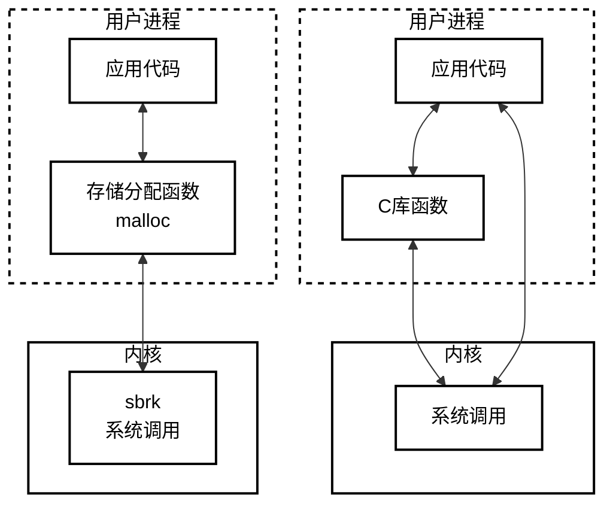

网址：http://www.apuebook.com/code3e.html

源码下载：http://www.apuebook.com/src.3e.tar.gz

Ubuntu软件包查找：https://launchpad.net/ubuntu

查看内核源码的网站1(只能搜索函数和宏定义)：https://elixir.bootlin.com/linux/v5.5.19/source

查看内核源码的网站2：https://lxr.missinglinkelectronics.com/

内核源码下载：https://mirrors.edge.kernel.org/pub/linux/kernel/

# 零. 源码编译

```shell
# 解压并进入
tar -xzvf src.3e.tar.gz
cd apue.3e

# 该库提供了一些在BSD系统上常用的功能，但在其他像GNU系统这样的系统上却没有。
# 说明网址https://launchpad.net/ubuntu/trusty/+package/libbsd-dev
sudo apt-get install libbsd-dev

# 确保echo $?返回0
make

# 安装
sudo cp ./include/apue.h /usr/local/include/
sudo cp ./lib/libapue.a /usr/local/lib/

# 以后在代码中加入如下头文件即可
#include “apue.h”
```


error.h

```c
#include "apue.h"
#include <errno.h>      /* for definition of errno */
#include <stdarg.h>     /* ISO C variable aruments */

static void err_doit(int, int, const char *, va_list);

/*
 * Nonfatal error related to a system call.
 * Print a message and return.
 */
void err_ret(const char *fmt, ...)
{
    va_list     ap;

    va_start(ap, fmt);
    err_doit(1, errno, fmt, ap);
    va_end(ap);
}


/*
 * Fatal error related to a system call.
 * Print a message and terminate.
 */
void err_sys(const char *fmt, ...)
{
    va_list     ap;

    va_start(ap, fmt);
    err_doit(1, errno, fmt, ap);
    va_end(ap);
    exit(1);
}


/*
 * Fatal error unrelated to a system call.
 * Error code passed as explict parameter.
 * Print a message and terminate.
 */
void err_exit(int error, const char *fmt, ...)
{
    va_list     ap;

    va_start(ap, fmt);
    err_doit(1, error, fmt, ap);
    va_end(ap);
    exit(1);
}


/*
 * Fatal error related to a system call.
 * Print a message, dump core, and terminate.
 */
void err_dump(const char *fmt, ...)
{
    va_list     ap;

    va_start(ap, fmt);
    err_doit(1, errno, fmt, ap);
    va_end(ap);
    abort();        /* dump core and terminate */
    exit(1);        /* shouldn't get here */
}


/*
 * Nonfatal error unrelated to a system call.
 * Print a message and return.
 */
void err_msg(const char *fmt, ...)
{
    va_list     ap;

    va_start(ap, fmt);
    err_doit(0, 0, fmt, ap);
    va_end(ap);
}


/*
 * Fatal error unrelated to a system call.
 * Print a message and terminate.
 */
void err_quit(const char *fmt, ...)
{
    va_list     ap;

    va_start(ap, fmt);
    err_doit(0, 0, fmt, ap);
    va_end(ap);
    exit(1);
}


/*
 * Print a message and return to caller.
 * Caller specifies "errnoflag".
 */
static void err_doit(int errnoflag, int error, const char *fmt, va_list ap)
{
    char    buf[MAXLINE];
    vsnprintf(buf, MAXLINE, fmt, ap);
    if (errnoflag)
    {
        snprintf(buf+strlen(buf), MAXLINE-strlen(buf), ": %s",
        strerror(error));
    }
    
    strcat(buf, "\n");
    fflush(stdout);     /* in case stdout and stderr are the same */
    fputs(buf, stderr);
    fflush(NULL);       /* flushes all stdio output streams */
}
```

报错1：undefined reference to 'major'

解决方法：include/apue.h添加#include <sys/sysmacros.h>

报错2：error: ‘FILE’ {aka ‘struct _IO_FILE’} has no member named ‘__pad’; did you mean ‘__pad5’?

stdio/buf.c注释掉：

```c
#ifdef _LP64
#define _flag __pad[4]
#define _ptr __pad[1]
#define _base __pad[2]
#endif

// 后面的
_flag 替换成 _flags
_base 替换成 _IO_buf_end
_ptr 替换成 _IO_buf_base
```

# 一. unix基础知识

## 1. 文件和目录

```shell
$ cd ./intro
$ gcc ls1.c -o ls2 -lapue
$ ./ls2 /dev
.
..
pts
stderr
stdout
stdin
fd
shm
block
sdc
sdb
sg2
....
$ ./ls2 /etc/ssl/private
can't open /etc/ssl/private: Permission denied
$ ./ls2 /etc/tty
can't open /etc/tty: No such file or directory
```

```c
#include "apue.h"
#include <dirent.h>

int main(int argc, char *argv[])
{
	DIR				*dp;
	struct dirent	*dirp;

	if (argc != 2)
		err_quit("usage: ls directory_name");

	if ((dp = opendir(argv[1])) == NULL)
		err_sys("can't open %s", argv[1]);
	while ((dirp = readdir(dp)) != NULL)
		printf("%s\n", dirp->d_name);

	closedir(dp);
	exit(0);
}
```

## 2. 输入和输出

函数open、read、write、lseek以及close提供了不带缓冲的I/O。这些函数都是用文件描述符。

```shell
$ cd ./intro
$ gcc mycat.c -o mycat2 -lapue
# 类似于复制文件的作用
$ ./mycat2 < mycat.c > mycat2.c
```
系统`<unistd.h>`提供的不带缓冲的I/O：
```c
#include "apue.h"

#define	BUFFSIZE	4096

int main(void)
{
	int		n;
	char	buf[BUFFSIZE];

	while ((n = read(STDIN_FILENO, buf, BUFFSIZE)) > 0)
		if (write(STDOUT_FILENO, buf, n) != n)
			err_sys("write error");

	if (n < 0)
		err_sys("read error");

	exit(0);
}
```
标准库`<stdio.h>`提供的带缓冲的I/O：
```c
#include "apue.h"

int main(void)
{
	int		c;

	while ((c = getc(stdin)) != EOF)
		if (putc(c, stdout) == EOF)
			err_sys("output error");

	if (ferror(stdin))
		err_sys("input error");

	exit(0);
}
```

## 3. 程序和进程

```shell
$ cd ./intro
$ gcc hello.c -o hello2 -lapue
# 类似于复制文件的作用
$ ./hello2
hello world from process ID 499
$ ./hello2
hello world from process ID 500

$ gcc shell1.c -o shell12 -lapue
$ ./shell12
% date
Sun Sep 25 14:35:32 CST 2022
% who
% pwd
/home/zuoc/work/unix/apue.3e/intro
% ls
Makefile  getcputc.c  hello.c  ls1    ls2    mycat.c  shell1	shell12  shell2.c   testerror.c  uidgid.c
getcputc  hello       hello2   ls1.c  mycat  mycat2   shell1.c	shell2	 testerror  uidgid
% ^D
$
```
打印pid：
```c
#include "apue.h"

int main(void)
{
    // getpid()返回pid_t，保证用long能存下
	printf("hello world from process ID %ld\n", (long)getpid());
	exit(0);
}
```
用子进程执行标准输入的命令：
```c
#include "apue.h"
#include <sys/wait.h>

int main(void)
{
	char	buf[MAXLINE];	/* from apue.h */
	pid_t	pid;
	int		status;

	printf("%% ");	/* print prompt (printf requires %% to print %) */
	while (fgets(buf, MAXLINE, stdin) != NULL) {
		if (buf[strlen(buf) - 1] == '\n')
			buf[strlen(buf) - 1] = 0; /* replace newline with null */

		if ((pid = fork()) < 0) {
			err_sys("fork error");
		} else if (pid == 0) {		/* child */
			execlp(buf, buf, (char *)0);
			err_ret("couldn't execute: %s", buf);
			exit(127);
		}

		/* parent */
		if ((pid = waitpid(pid, &status, 0)) < 0)
			err_sys("waitpid error");
		printf("%% ");
	}
	exit(0);
}
```

## 4. 出错处理

```shell
$ cd ./intro
$ gcc testerror.c -o testerror2 -lapue
$ ./testerror2
EACCES: Permission denied
./testerror2: No such file or directory
```

```c
#include "apue.h"
#include <errno.h>

int main(int argc, char *argv[])
{
	fprintf(stderr, "EACCES: %s\n", strerror(EACCES));
	errno = ENOENT;
    // argv[0]可以指示那个程序报错
	perror(argv[0]);
	exit(0);
}
```

## 5. 用户id和组id

```
$ cd ./intro
$ gcc uidgid.c -o uidgid2 -lapue
$ ./uidgid2
uid = 1000, gid = 1000
```

```c
#include "apue.h"

int main(void)
{
	printf("uid = %d, gid = %d\n", getuid(), getgid());
	exit(0);
}
```

## 9. 信号

进程有以下3种处理信号的方式：

1. 忽略信号。
2. 按系统默认方式处理。
3. 提供一个函数，信号发生时调用该函数，这被称为捕捉该信号。

```shell
$ cd ./intro
$ gcc shell2.c -o shell22 -lapue
$ ./shell22
% pwd
/home/zuoc/work/unix/apue.3e/intro
% ^Cinterrupt   <-----Ctrl+C表示中断键，从sig_int函数退出时while没有继续执行
% 
$
```

```c
#include "apue.h"
#include <sys/wait.h>

static void	sig_int(int);		/* our signal-catching function */

int main(void)
{
	char	buf[MAXLINE];	/* from apue.h */
	pid_t	pid;
	int		status;

	if (signal(SIGINT, sig_int) == SIG_ERR)
		err_sys("signal error");

	printf("%% ");	/* print prompt (printf requires %% to print %) */
	while (fgets(buf, MAXLINE, stdin) != NULL) {
		if (buf[strlen(buf) - 1] == '\n')
			buf[strlen(buf) - 1] = 0; /* replace newline with null */

		if ((pid = fork()) < 0) {
			err_sys("fork error");
		} else if (pid == 0) {		/* child */
			execlp(buf, buf, (char *)0);
			err_ret("couldn't execute: %s", buf);
			exit(127);
		}

		/* parent */
		if ((pid = waitpid(pid, &status, 0)) < 0)
			err_sys("waitpid error");
		printf("%% ");
	}
	exit(0);
}

void sig_int(int signo)
{
	printf("interrupt\n%% ");
}
```

## 11. 系统调用和库函数




# 二. UNIX标准及实现

## 2.2 UNIX标准化

### 2.2.2 IEEE POSIX

内核源码位置include/linux/aio.h，对应的Ubuntu中路径为/usr/include/aio.h。

<a id="table2-2">图2-2  POSIX标准定义的必须的头文件</a>

| 头文件          | 说明                       | 内核源码位置        |
| --------------- | -------------------------- | ------------------- |
| <aio.h>         | 异步I/O                    | include/linux/aio.h |
| <cpio.h>        | cpio归档值                 |                     |
| <dirent.h>      | 目录项（4.22节）           |                     |
| <dlfcn.h>       | 动态链接                   |                     |
| <fcntl.h>       | 文件控制（3.14节）         |                     |
| <fnmatch.h>     | 文件名匹配类型             |                     |
| <glob.h>        | 路径名模式匹配与生成       |                     |
| <grp.h>         | 组文件（6.4节）            |                     |
| <iconv.h>       | 代码集变换实用程序         |                     |
| <langinfo.h>    | 语言信息常量               |                     |
| <monetary.h>    | 货币类型与函数             |                     |
| <netdb.h>       | 网络数据库操作             |                     |
| <nl_types.h>    | 消息类                     |                     |
| <poll.h>        | 投票函数（14.4.2节）       |                     |
| <pthread.h>     | 线程（第11章、第12章）     |                     |
| <pwd.h>         | 口令文件（6.2节）          |                     |
| <regex.h>       | 正则表达式                 |                     |
| <sched.h>       | 执行调度                   |                     |
| <semaphore.h>   | 信号量                     |                     |
| <strings.h>     | 字符串操作                 |                     |
| <tar.h>         | tar归档值                  |                     |
| <termios.h>     | 终端I/O（第18章）          |                     |
| <unistd.h>      | 符号常量                   |                     |
| <wordexp.h>     | 字扩充类型                 |                     |
|                 |                            |                     |
| <arpa/inet.h>   | 英特网定义（第16章）       |                     |
| <net/if.h>      | 套接字本地接口（第16章）   |                     |
| <netinet/in.h>  | 英特网地址族（16.3节）     |                     |
| <netinet/tcp.h> | 传输控制协议定义           |                     |
|                 |                            |                     |
| <sys/mman.h>    | 存储管理声明               |                     |
| <sys/select.h>  | select函数（14.4.1节）     |                     |
| <sys/socket.h>  | 套接字接口（第16章）       |                     |
| <sys/stat.h>    | 文件状态（第4章）          |                     |
| <sys/statvfs.h> | 文件系统信息               |                     |
| <sys/times.h>   | 进程时间（8.17节）         |                     |
| <sys/types.h>   | 基本系统数据类型（2.8节）  |                     |
| <sys/un.h>      | UNIX域套接字定义（17.2节） |                     |
| <sys/unsname.h> | 系统名（6.9节）            |                     |
| <sys/wait.h>    | 进程控制（8.6节）          |                     |

## 2.5 限制

### 2.5.4 函数sysconf、pathconf和fpathconf

```shell
$ cd ./standards
$ cp conf.c.modified conf.c
$ gcc conf.c -o conf -lapue
$ ./conf .
no symbol for ARG_MAX
ARG_MAX = 2097152
MAX_CANON defined to be 255
MAX_CANON = 255
```

由awk产生的C程序：

```c
#include "apue.h"
#include <errno.h>
#include <limits.h>

static void	pr_sysconf(char *, int);
static void	pr_pathconf(char *, char *, int);

int main(int argc, char *argv[])
{
	if (argc != 2)
		err_quit("usage: a.out <dirname>");

#ifdef ARG_MAX
	printf("ARG_MAX defined to be %ld\n", (long)ARG_MAX+0);
#else
	printf("no symbol for ARG_MAX\n");
#endif
#ifdef _SC_ARG_MAX
	pr_sysconf("ARG_MAX =", _SC_ARG_MAX);
#else
	printf("no symbol for _SC_ARG_MAX\n");
#endif

/* similar processing for all the rest of the sysconf symbols... */

#ifdef MAX_CANON
	printf("MAX_CANON defined to be %ld\n", (long)MAX_CANON+0);
#else
	printf("no symbol for MAX_CANON\n");
#endif
#ifdef _PC_MAX_CANON
	pr_pathconf("MAX_CANON =", argv[1], _PC_MAX_CANON);
#else
	printf("no symbol for _PC_MAX_CANON\n");
#endif

/* similar processing for all the rest of the pathconf symbols... */

	exit(0);
}

static void pr_sysconf(char *mesg, int name)
{
	long	val;

	fputs(mesg, stdout);
	errno = 0;
	if ((val = sysconf(name)) < 0) {
		if (errno != 0) {
			if (errno == EINVAL)
				fputs(" (not supported)\n", stdout);
			else
				err_sys("sysconf error");
		} else {
			fputs(" (no limit)\n", stdout);
		}
	} else {
		printf(" %ld\n", val);
	}
}

static void pr_pathconf(char *mesg, char *path, int name)
{
	long	val;

	fputs(mesg, stdout);
	errno = 0;
	if ((val = pathconf(path, name)) < 0) {
		if (errno != 0) {
			if (errno == EINVAL)
				fputs(" (not supported)\n", stdout);
			else
				err_sys("pathconf error, path = %s", path);
		} else {
			fputs(" (no limit)\n", stdout);
		}
	} else {
		printf(" %ld\n", val);
	}
}
```

### 2.5.5 不确定的运行时限制

1. 路径名

path_alloc函数分配存储路径的内存，sizep指示其大小。

```c
#include "apue.h"
#include <errno.h>
#include <limits.h>

#ifdef	PATH_MAX
static long	pathmax = PATH_MAX;
#else
static long	pathmax = 0;
#endif

static long	posix_version = 0;
static long	xsi_version = 0;

/* If PATH_MAX is indeterminate, no guarantee this is adequate 如果PATH_MAX是不确定的，不能保证它是充分的*/
#define	PATH_MAX_GUESS	1024

char *
path_alloc(size_t *sizep) /* also return allocated size, if nonnull */
{
	char	*ptr;
	size_t	size;

	if (posix_version == 0)
		posix_version = sysconf(_SC_VERSION);

	if (xsi_version == 0)
		xsi_version = sysconf(_SC_XOPEN_VERSION);

	if (pathmax == 0) {		/* first time through */
		errno = 0;
		if ((pathmax = pathconf("/", _PC_PATH_MAX)) < 0) {
			if (errno == 0)
				pathmax = PATH_MAX_GUESS;	/* it's indeterminate */
			else
				err_sys("pathconf error for _PC_PATH_MAX");
		} else {
			pathmax++;		/* add one since it's relative to root 加上1，因为它是相对根结点的*/
		}
	}

	/*
	 * Before POSIX.1-2001, we aren't guaranteed that PATH_MAX includes
	 * the terminating null byte.  Same goes for XPG3.
	 */
    // 在POSIX.1-2001之前，不能保证PATH_MAX包含结束空字节。XPG3也是如此。
	if ((posix_version < 200112L) && (xsi_version < 4))
		size = pathmax + 1;
	else
		size = pathmax;

	if ((ptr = malloc(size)) == NULL)
		err_sys("malloc error for pathname");

	if (sizep != NULL)
		*sizep = size;
	return(ptr);
}
```

2. 最大打开文件数

```c
#include "apue.h"
#include <errno.h>
#include <limits.h>

#ifdef	OPEN_MAX
static long	openmax = OPEN_MAX;
#else
static long	openmax = 0;
#endif

/*
 * If OPEN_MAX is indeterminate, this might be inadequate.
 */
#define	OPEN_MAX_GUESS	256

long open_max(void)
{
	if (openmax == 0) {		/* first time through */
		errno = 0;
		if ((openmax = sysconf(_SC_OPEN_MAX)) < 0) {
			if (errno == 0)
				openmax = OPEN_MAX_GUESS;	/* it's indeterminate */
			else
				err_sys("sysconf error for _SC_OPEN_MAX");
		}
	}
	return(openmax);
}
```

## 2.8 基本系统数据类型

头文件<sys/types.h>中定义了某些与实现相关的数据类型，他们被称为基本系统数据类型。

<a id="table2-2">图2-21  一些常用的基本系统数据类型</a>

| 类型         | 说明                                                 |
| ------------ | ---------------------------------------------------- |
| clock_t      | 时钟滴答计数器（进程时间）（1.10节）                 |
| comp_t       | 压缩的时钟滴答（POSIX.1未定义；8.14节）              |
| dev_t        | 设备号（主和次）（4.24节）                           |
| fd_set       | 文件描述符集（14.4.1节）                             |
| fpos_t       | 文件位置（5.10节）                                   |
| gid_t        | 数值  组ID                                           |
| ino_t        | i节点编号（4.14节）                                  |
| mode_t       | 文件类型，文件创建模式（4.5节）                      |
| nlink_t      | 目录项的链接计数（4.14节）                           |
| off_t        | 文件长度和偏移量（带符号的）（lseek，3.6节）         |
| pid_t        | 进程ID和进程组ID（带符号的）（8.2和9.4节）           |
| pthread_t    | 线程ID（11.3节）                                     |
| ptrdiff_t    | 两个指针相减的结果（带符号的）                       |
| rlim_t       | 资源限制（7.11节）                                   |
| sig_atomic_t | 能原子性地访问的数据类型（10.15节）                  |
| sigset_t     | 信号集（10.11节）                                    |
| size_t       | 对象（如字符串）长度（不带符号的）（3.7节）          |
| ssize_t      | 返回字节计数的函数（带符号的）（read、write，3.7节） |
| time_t       | 日历时间的秒计数器（1.10节）                         |
| uid_t        | 数值  用户ID                                         |
| wchar_t      | 能表示所有不同的字节码                               |

# 三. 文件I/O

## 3.6 函数 lseek

```shell
$ cd ./fileio
$ gcc seek.c -o seek2 -lapue
$ ./seek2 < /etc/passwd
seek OK
$ cat < /etc/passwd | ./seek2
cannot seek
$ ./seek2 < /var/spool/cron/FIFO
cannot seek

$ gcc hole.c -o hole2 -lapue
$ ./hole2
# 检查其大小，file.hole占用8个磁盘块，file.nohole占用20个磁盘块
$ ls -ls file.hole file.nohole
 8 -rw-r--r-- 1 zuoc zuoc 16394 Sep 29 13:47 file.hole
20 -rw-r--r-- 1 zuoc zuoc 16394 Sep 29 13:47 file.nohole
# 观察实际内容
$ od -c file.hole
0000000   a   b   c   d   e   f   g   h   i   j  \0  \0  \0  \0  \0  \0
0000020  \0  \0  \0  \0  \0  \0  \0  \0  \0  \0  \0  \0  \0  \0  \0  \0
*
0040000   A   B   C   D   E   F   G   H   I   J
0040012
```

图3-1  测试标准输入能否被设置偏移量

```c
#include "apue.h"

int main(void)
{
	if (lseek(STDIN_FILENO, 0, SEEK_CUR) == -1)
		printf("cannot seek\n");
	else
		printf("seek OK\n");
	exit(0);
}
```

图3-2  创建一个具有空洞的文件

```c
#include "apue.h"
#include <fcntl.h>

char	buf1[] = "abcdefghij";
char	buf2[] = "ABCDEFGHIJ";

int main(void)
{
	int		fd1, fd2;
    int     offset = 16384;

    // 创建有空洞文件
	if ((fd1 = creat("file.hole", FILE_MODE)) < 0)
		err_sys("creat error");

	if (write(fd1, buf1, 10) != 10)
		err_sys("buf1 write error");
	/* offset now = 10 */

	if (lseek(fd1, offset, SEEK_SET) == -1)
		err_sys("lseek error");
	/* offset now = 16384 */

	if (write(fd1, buf2, 10) != 10)
		err_sys("buf2 write error");
	/* offset now = 16394 */

    // 创建无空洞文件
    if ((fd2 = creat("file.nohole", FILE_MODE)) < 0)
		err_sys("creat error");
    
    int start = 0;
    while (start < offset) {
        if (start + 10 < offset) {
            if (write(fd2, buf1, 10) != 10)
		        err_sys("buf1 write error");
            start += 10;
        } else {
            if (write(fd2, buf1, offset - start) != offset - start)
		        err_sys("buf1 write error");
            start = offset;
        }
    }
    /* offset now = 16384 */

	if (write(fd2, buf2, 10) != 10)
		err_sys("buf2 write error");
	/* offset now = 16394 */
    
	exit(0);
}
```

## 3.9 I/O的效率
## 3.14 函数 fcntl

```shell
$ cd ./fileio
$ gcc fileflags.c -o fileflags2 -lapue
$ ./fileflags2 0 < /dev/tty
read only
$ ./fileflags2 1 > temp.foo
$ cat temp.foo
write only
$ ./fileflags2 2 2>>temp.foo
write only, append
$ ./fileflags2 5 5<>temp.foo
read write
```

图3-11  对于指定的文件描述符打印文件标志

```c
#include "apue.h"
#include <fcntl.h>

int main(int argc, char *argv[])
{
	int		val;

	if (argc != 2)
		err_quit("usage: a.out <descriptor#>");

	if ((val = fcntl(atoi(argv[1]), F_GETFL, 0)) < 0)
		err_sys("fcntl error for fd %d", atoi(argv[1]));

	switch (val & O_ACCMODE) {
	case O_RDONLY:
		printf("read only");
		break;

	case O_WRONLY:
		printf("write only");
		break;

	case O_RDWR:
		printf("read write");
		break;

	default:
		err_dump("unknown access mode");
	}

	if (val & O_APPEND)
		printf(", append");
	if (val & O_NONBLOCK)
		printf(", nonblocking");
	if (val & O_SYNC)
		printf(", synchronous writes");

#if !defined(_POSIX_C_SOURCE) && defined(O_FSYNC) && (O_FSYNC != O_SYNC)
	if (val & O_FSYNC)
		printf(", synchronous writes");
#endif

	putchar('\n');
	exit(0);
}
```

图3-12  对一个文件描述符开启一个或多个文件状态标志

```c
#include "apue.h"
#include <fcntl.h>

void set_fl(int fd, int flags) /* flags are file status flags to turn on */
{
	int		val;

	if ((val = fcntl(fd, F_GETFL, 0)) < 0)
		err_sys("fcntl F_GETFL error");

	val |= flags;		/* turn on flags */

	if (fcntl(fd, F_SETFL, val) < 0)
		err_sys("fcntl F_SETFL error");
}
```

## 3.15 函数 ioctl

ioctl是设备驱动程序中对设备的I/O通道进行管理的函数。所谓对I/O通道进行管理，就是对设备的一些特性进行控制，例如串口的传输波特率、马达的转速等等。

```c
#include <unistd.h>  /* System V */
#include <sys/ioctl.h>  /* BSD and Linux */

int ioctl(int fd, int request, ...);
```

# 四. 文件和目录

## 4.1 引言

## 4.2 函数stat、fstat、fstatat和lstat

## 4.3 文件类型

```shell
$ cd ./filedir
$ gcc filetype.c -o filetype2 -lapue
$ ./filetype2 /etc/passwd /etc /dev/log /dev/tty \
> /var/lib/oprofile/opd_pipe /dev/sr0 /dev/cdrom
/etc/passwd: regular
/etc: directory
/dev/log: socket
/dev/tty: character special
/var/lib/oprofile/opd_pipe: fifo
/dev/sr0: block special
/dev/cdrom: symbolic link
```

图4-3 对每个命令行参数打印文件类型

```c
#include "apue.h"

int main(int argc, char *argv[])
{
	int			i;
	struct stat	buf;
	char		*ptr;

	for (i = 1; i < argc; i++) {
		printf("%s: ", argv[i]);
		if (lstat(argv[i], &buf) < 0) {
			err_ret("lstat error");
			continue;
		}
		if (S_ISREG(buf.st_mode))
			ptr = "regular";
		else if (S_ISDIR(buf.st_mode))
			ptr = "directory";
		else if (S_ISCHR(buf.st_mode))
			ptr = "character special";
		else if (S_ISBLK(buf.st_mode))
			ptr = "block special";
		else if (S_ISFIFO(buf.st_mode))
			ptr = "fifo";
		else if (S_ISLNK(buf.st_mode))
			ptr = "symbolic link";
		else if (S_ISSOCK(buf.st_mode))
			ptr = "socket";
		else
			ptr = "** unknown mode **";
		printf("%s\n", ptr);
	}
	exit(0);
}
```

## 4.8 函数access和faccessat

```c
#include <unistd.h>

// 按实际用户ID和实际组ID进行访问权限测试
// mode：R_OK测试读权限  W_OK测试写权限  X_OK测试执行权限
int access(const char *pathname, int mode);
// 1.pathname为绝对路径，fd被忽略
// 2.pathname为相对路径，fd为AT_FDCWD
// 3.pathname为相对于fd的相对路径
// flag：AT_EACCESS，使用有效用户ID和有效组ID
int faccessat(int fd, const char *pathname, int mode, int flag);
                                                                  // 两个函数的返回值：若成功，返回0；若出错，返回-1
```

```shell
$ cd ./filedir
$ gcc access.c -o access2 -lapue
$ ls -l access2
-rwxrwxr-x 1 zuoc zuoc 17584 Sep 29 20:15 access2
$ ./access2 access2
read access OK
open for reading OK
$ ls -l /etc/shadow
-rw-r----- 1 root shadow 1078 Sep  3 22:59 /etc/shadow
$ ./access2 /etc/shadow
access error for /etc/shadow: Permission denied
open error for /etc/shadow: Permission denied
# 称为超级用户
$ su
Password: 
# 将文件用户ID改为 root
$ chown root access2
# 并打开设置用户ID位
$ chmod u+s access2
# 检查所有者和SUID位
$ ls -l access2
-rwsrwxr-x 1 root zuoc 17584 Sep 29 20:15 access2
# 恢复为正常用户
$ exit
$ ./access2 /etc/shadow
access error for /etc/shadow: Permission denied
open for reading OK
```

图4-8  access函数实例

```c
#include "apue.h"
#include <fcntl.h>

int main(int argc, char *argv[])
{
	if (argc != 2)
		err_quit("usage: a.out <pathname>");
	if (access(argv[1], R_OK) < 0)
		err_ret("access error for %s", argv[1]);
	else
		printf("read access OK\n");
	if (open(argv[1], O_RDONLY) < 0)
		err_ret("open error for %s", argv[1]);
	else
		printf("open for reading OK\n");
	exit(0);
}
```

## 4.8 函数umask

```shell
$ cd ./filedir
$ gcc umask.c -o umask2 -lapue
$ umask
0002
$ ./umask2
$ ls -l foo bar
-rw------- 1 zuoc zuoc 0 Sep 30 11:02 bar
-rw-rw-rw- 1 zuoc zuoc 0 Sep 30 11:02 foo
$ umask
0002
```

图4-9  umask函数实例

```c
#include "apue.h"
#include <fcntl.h>

#define RWRWRW (S_IRUSR|S_IWUSR|S_IRGRP|S_IWGRP|S_IROTH|S_IWOTH)

int main(void)
{
	umask(0);
	if (creat("foo", RWRWRW) < 0)
		err_sys("creat error for foo");
	umask(S_IRGRP | S_IWGRP | S_IROTH | S_IWOTH);
	if (creat("bar", RWRWRW) < 0)
		err_sys("creat error for bar");
	exit(0);
}
```

## 4.9 函数chmod、fchmod 和 fchmodat

```c
#include <sys/stat.h>

int chmod(const char *pathname, mode_t mode);
int fchmod (int fd, mode_t mode);
// flag设置为AT_SYMLINK_NOFOLLOW标志时，fchmodat更改符号链接本身而不是所指向的文件
int fchmodat(int fd, const char *pathname, mode_t mode, int flag);
                                                                    // 3个函数返回值：若成功，返回0；若出错，返回-1
```

```shell
$ cd ./filedir
$ gcc changemod.c -o changemod2 -lapue
$ ls -l foo bar
-rw------- 1 zuoc zuoc 0 Sep 30 11:02 bar
-rw-rw-rw- 1 zuoc zuoc 0 Sep 30 11:02 foo
$ ./changemod2
$ ls -l foo bar
-rw-r--r-- 1 zuoc zuoc 0 Sep 30 11:02 bar
-rw-rwSrw- 1 zuoc zuoc 0 Sep 30 11:02 foo
```

图4-12  chmod函数实例

```c
#include "apue.h"

int main(void)
{
	struct stat		statbuf;

	/* turn on set-group-ID and turn off group-execute */

	if (stat("foo", &statbuf) < 0)
		err_sys("stat error for foo");
	if (chmod("foo", (statbuf.st_mode & ~S_IXGRP) | S_ISGID) < 0)
		err_sys("chmod error for foo");

	/* set absolute mode to "rw-r--r--" */

	if (chmod("bar", S_IRUSR | S_IWUSR | S_IRGRP | S_IROTH) < 0)
		err_sys("chmod error for bar");

	exit(0);
}
```

# 十六. 网络IPC：套接字

## 16.2 套接字描述符

```c
#include <sys/socket.h>

int socket(int domain, int type, int protocol);
                                                           // 返回值：若成功，返回文件（套接字）描述符；若出错，返回-1
```

## 16.3 寻址

### 16.3.2 地址格式

```c
#include <arpa/inet.h>

// 字符串转in_addr的函数：
int inet_aton(const char *strptr, struct in_addr *addrptr);
in_addr_t inet_addr(const char *strptr);
int inet_pton(int family, const char *strptr, void *addrptr);

// in_addr转字符串的函数：
char *inet_ntoa(struct in_addr inaddr);
const char *inet_ntop(int family, const void *addrptr, char *strptr, size_t len);
```

其中inet_pton和inet_ntop不仅可以转换IPv4的in_addr，还可以转换IPv6的in6_addr，因此函数接口是void *addrptr。

### 16.3.3 地址查询

#### 1. 查询主机信息：/etc/hosts

```c
#include <netdb.h>

struct hostent {
    char  *h_name;
    char **h_aliases;
    int    h_addrtype;
    int    h_length;
    char **h_addr_list;
    ...
}

// 返回值：若成功，返回指针；若出错，返回NULL
struct hostent *gethostent(void);
void sethostent(int stayopen);
void endhostent(void);
```

其它函数：

```c
struct hostent * gethostbyname (const char *name);
struct hostent * gethostbyname2 (const char *name, int af);
struct hostent * gethostbyaddr (const void *addr, socklen_t length, int format);
```

其它函数的替代函数：

```c
#include <sys/socket.h>
#include <netdb.h>

struct addrinfo {
    int               ai_flags;
    int               ai_family;
    int               ai_socktype;
    int               ai_protocol;
    socklen_t         ai_addrlen;
    struct sockaddr  *ai_addr;
    char             *ai_canonname;
    struct addrinfo **ai_next;
    ...
}

// 返回值：若成功，返回0；若出错，返回非0错误码
int getaddrinfo(const char *restrict host,
                const char *restrict service,
                const struct addrinfo *restrict hint,
                struct addrinfo **restrict res);

void freeaddrinfo(struct addrinfo *ai);

// 若getaddrinfo出错，不能使用perror或strerror来生成错误消息
const char *gai_strerror(int error);

// 将一个地址转换成一个主机名和一个服务名
// 返回值：若成功，返回0；若出错，返回非0值
int getnameinfo(const struct sockaddr *restrict addr, socklen_t alen,
                char *restrict host, socklen_t hostlen,
                char *restrict service, socklen_t servlen, int flags);
```

实例代码：

```c
#include <stdio.h>
#include <netdb.h>
#include <arpa/inet.h>

int main()
{
    sethostent(1);
    struct hostent *ent = gethostent();
    int i = 1;
    while (ent != NULL) {
        printf("-----%d-----\n", i++);
        printf("h_name: %s\n", ent->h_name);
        int m = 0;
        while (ent->h_aliases[m] != NULL) {
             printf("h_aliases: %s\n", ent->h_aliases[m++]);
        }
        printf("h_addrtype: %s\n", ent->h_addrtype == AF_INET ? "AF_INET" : "AF_INET6");
        printf("h_length: %d\n", ent->h_length);
        m = 0;
        char buf[INET_ADDRSTRLEN] = {0};
        while (ent->h_addr_list[m] != NULL) {
            printf("h_addr_list: %s\n", inet_ntop(ent->h_addrtype, ent->h_addr_list[m++], buf, INET_ADDRSTRLEN));
        }

        ent = gethostent();
    }
    endhostent();
    return 0;
}
```

结果：

```shell
-----1-----
h_name: localhost
h_addrtype: AF_INET
h_length: 4
h_addr_list: 127.0.0.1
-----2-----
h_name: zuoc.localdomain
h_aliases: zuoc
h_addrtype: AF_INET
h_length: 4
h_addr_list: 127.0.1.1
-----3-----
h_name: activate.navicat.com
h_addrtype: AF_INET
h_length: 4
h_addr_list: 127.0.0.1
-----4-----
h_name: ip6-localhost
h_aliases: ip6-loopback
h_addrtype: AF_INET
h_length: 4
h_addr_list: 127.0.0.1
```

#### 2. 网络名字和网络编号：/etc/networks

```c
#include <netdb.h>

struct netent {
    char    *n_name;
    char   **n_aliases;
    int      n_addrtype;
    uint32_t n_net;
    ...
}

// 3个函数的返回值：若成功，返回指针；若出错，返回NULL
struct netent *getnetbyaddr(uint32_t net, int type);
struct netent *getnetbyname(const char *name);
struct netent *getnetent(void);

void setnetent(int stayopen);
void endnetent(void);
```

实例代码：

```c
#include <stdio.h>
#include <netdb.h>
#include <arpa/inet.h>

int main()
{
    setnetent(1);
    struct netent *ent = getnetent();
    int i = 1;
    while (ent != NULL) {
        printf("-----%d-----\n", i++);
        printf("n_name: %s\n", ent->n_name);
        int m = 0;
        while (ent->n_aliases[m] != NULL) {
             printf("n_aliases: %s\n", ent->n_aliases[m++]);
        }
        printf("n_addrtype: %s\n", ent->n_addrtype == AF_INET ? "AF_INET" : "AF_INET6");
        char buf[INET_ADDRSTRLEN] = {0};
        printf("n_net: %s\n", inet_ntop(ent->n_addrtype, &(ent->n_net), buf, INET_ADDRSTRLEN));

        ent = getnetent();
    }
    endnetent();
    return 0;
}
```

结果：

```shell
-----1-----
n_name: link-local
n_addrtype: AF_INET
n_net: 0.0.254.169
```

#### 3. 协议名字和协议编号：/etc/protocols

```c
#include <netdb.h>

struct protoent {
    char    *p_name;
    char   **p_aliases;
    int      p_proto;
    ...
}

// 3个函数的返回值：若成功，返回指针；若出错，返回NULL
struct protoent *getprotobyname(const char *name);
struct protoent *getprotobynumber(int proto);
struct protoent *getprotoent(void);

void setprotoent(int stayopen);
void endprotoent(void);
```

实例代码：

```c
#include <stdio.h>
#include <netdb.h>
#include <arpa/inet.h>

int main()
{
    setprotoent(1);
    struct protoent *ent = getprotoent();
    int i = 1;
    while (ent != NULL) {
        printf("-----%d-----\n", i++);
        printf("p_name: %s\n", ent->p_name);
        int m = 0;
        while (ent->p_aliases[m] != NULL) {
             printf("p_aliases: %s\n", ent->p_aliases[m++]);
        }
        printf("p_proto: %d\n", ent->p_proto);

        ent = getprotoent();
    }
    endprotoent();
    return 0;
}
```

结果：

```shell
-----1-----
p_name: ip
p_aliases: IP
p_proto: 0
-----2-----
p_name: hopopt
p_aliases: HOPOPT
p_proto: 0
-----3-----
p_name: icmp
p_aliases: ICMP
p_proto: 1
-----4-----
p_name: igmp
p_aliases: IGMP
p_proto: 2
-----5-----
p_name: ggp
p_aliases: GGP
p_proto: 3
-----6-----
p_name: ipencap
p_aliases: IP-ENCAP
p_proto: 4
-----7-----
p_name: st
p_aliases: ST
p_proto: 5
-----8-----
p_name: tcp
p_aliases: TCP
p_proto: 6
-----9-----
p_name: egp
p_aliases: EGP
p_proto: 8
-----10-----
p_name: igp
p_aliases: IGP
p_proto: 9
-----11-----
p_name: pup
p_aliases: PUP
p_proto: 12
-----12-----
p_name: udp
p_aliases: UDP
p_proto: 17
-----13-----
p_name: hmp
p_aliases: HMP
p_proto: 20
-----14-----
p_name: xns-idp
p_aliases: XNS-IDP
p_proto: 22
-----15-----
p_name: rdp
p_aliases: RDP
p_proto: 27
-----16-----
p_name: iso-tp4
p_aliases: ISO-TP4
p_proto: 29
-----17-----
p_name: dccp
p_aliases: DCCP
p_proto: 33
-----18-----
p_name: xtp
p_aliases: XTP
p_proto: 36
-----19-----
p_name: ddp
p_aliases: DDP
p_proto: 37
-----20-----
p_name: idpr-cmtp
p_aliases: IDPR-CMTP
p_proto: 38
-----21-----
p_name: ipv6
p_aliases: IPv6
p_proto: 41
-----22-----
p_name: ipv6-route
p_aliases: IPv6-Route
p_proto: 43
-----23-----
p_name: ipv6-frag
p_aliases: IPv6-Frag
p_proto: 44
-----24-----
p_name: idrp
p_aliases: IDRP
p_proto: 45
-----25-----
p_name: rsvp
p_aliases: RSVP
p_proto: 46
-----26-----
p_name: gre
p_aliases: GRE
p_proto: 47
-----27-----
p_name: esp
p_aliases: IPSEC-ESP
p_proto: 50
-----28-----
p_name: ah
p_aliases: IPSEC-AH
p_proto: 51
-----29-----
p_name: skip
p_aliases: SKIP
p_proto: 57
-----30-----
p_name: ipv6-icmp
p_aliases: IPv6-ICMP
p_proto: 58
-----31-----
p_name: ipv6-nonxt
p_aliases: IPv6-NoNxt
p_proto: 59
-----32-----
p_name: ipv6-opts
p_aliases: IPv6-Opts
p_proto: 60
-----33-----
p_name: rspf
p_aliases: RSPF
p_aliases: CPHB
p_proto: 73
-----34-----
p_name: vmtp
p_aliases: VMTP
p_proto: 81
-----35-----
p_name: eigrp
p_aliases: EIGRP
p_proto: 88
-----36-----
p_name: ospf
p_aliases: OSPFIGP
p_proto: 89
-----37-----
p_name: ax.25
p_aliases: AX.25
p_proto: 93
-----38-----
p_name: ipip
p_aliases: IPIP
p_proto: 94
-----39-----
p_name: etherip
p_aliases: ETHERIP
p_proto: 97
-----40-----
p_name: encap
p_aliases: ENCAP
p_proto: 98
-----41-----
p_name: pim
p_aliases: PIM
p_proto: 103
-----42-----
p_name: ipcomp
p_aliases: IPCOMP
p_proto: 108
-----43-----
p_name: vrrp
p_aliases: VRRP
p_proto: 112
-----44-----
p_name: l2tp
p_aliases: L2TP
p_proto: 115
-----45-----
p_name: isis
p_aliases: ISIS
p_proto: 124
-----46-----
p_name: sctp
p_aliases: SCTP
p_proto: 132
-----47-----
p_name: fc
p_aliases: FC
p_proto: 133
-----48-----
p_name: mobility-header
p_aliases: Mobility-Header
p_proto: 135
-----49-----
p_name: udplite
p_aliases: UDPLite
p_proto: 136
-----50-----
p_name: mpls-in-ip
p_aliases: MPLS-in-IP
p_proto: 137
-----51-----
p_name: manet
p_proto: 138
-----52-----
p_name: hip
p_aliases: HIP
p_proto: 139
-----53-----
p_name: shim6
p_aliases: Shim6
p_proto: 140
-----54-----
p_name: wesp
p_aliases: WESP
p_proto: 141
-----55-----
p_name: rohc
p_aliases: ROHC
p_proto: 142
```

#### 4. 服务名和端口号：/etc/services 

```c
#include <netdb.h>

struct servent {
    char    *s_name;
    char   **s_aliases;
    int      s_port;
    char    *s_proto;
    ...
}

// 3个函数的返回值：若成功，返回指针；若出错，返回NULL
struct servent *getservbyname(const char *name, const char *proto);
struct servent *getservbyport(int port, const char *proto);
struct servent *getservent(void);

void setservent(int stayopen);
void endservent(void);
```

实例代码：

```c
#include <stdio.h>
#include <netdb.h>
#include <arpa/inet.h>

int main()
{
    setservent(1);
    struct servent *ent = getservent();
    int i = 1;
    while (ent != NULL) {
        if (i > 5) {
            break;
        }
        printf("-----%d-----\n", i++);
        printf("s_name: %s\n", ent->s_name);
        int m = 0;
        while (ent->s_aliases[m] != NULL) {
             printf("s_aliases: %s\n", ent->s_aliases[m++]);
        }
        printf("s_port: %d\n", ent->s_port);
        printf("s_proto: %s\n", ent->s_proto);

        ent = getservent();
    }
    endservent();
    return 0;
}
```

结果：

```shell
-----1-----
s_name: tcpmux
s_port: 256
s_proto: tcp
-----2-----
s_name: echo
s_port: 1792
s_proto: tcp
-----3-----
s_name: echo
s_port: 1792
s_proto: udp
-----4-----
s_name: discard
s_aliases: sink
s_aliases: null
s_port: 2304
s_proto: tcp
-----5-----
s_name: discard
s_aliases: sink
s_aliases: null
s_port: 2304
s_proto: udp
```

## 16.5 数据传输

```c
#include <sys/socket.h>

// 返回值：若成功，返回发送的字节数；若出错，返回-1
ssize_t send(int sockfd, const void *buf, size_t nbytes, int flags);
// 与send相似，区别在于可以在无连接的套接字上指定一个目标地址
ssize_t sendto(int sockfd, const void *buf, size_t nbytes, int flags,
               const struct sockaddr *destaddr, socklen_t destlen);

// 返回值：返回数据的字节长度；若无可用数据或对等方已经按序结束，返回0；若出错，返回-1
ssize_t recv(int sockfd, void *buf, size_t nbytes, int flags);
// 与recv相似，区别在于可以获得数据发送者的源地址
ssize_t recvfrom(int sockfd, void *restrict buf, size_t len, int flags,
                 struct sockaddr *restrict addr,
                 socklen_t *restrict addrlen);

struct iovec {
    void  *iov_base;
    size_t iov_len;
};

struct msghdr {
    void         *msg_name;
    socklen_t     msg_namelen;
    struct iovec *msg_iov;
    int           msg_iovlen;
    void         *msg_control;
    socklen_t     msg_controllen;
    int           msg_flags;
    ...
};

ssize_t sendmsg(int sockfd, const struct msghdr *msg, int flags);
ssize_t recvmsg(int sockfd, struct msghdr *msg, int flags);
```

## 16.6 套接字选项

```c
#include <sys/socket.h>

// 返回值：若成功，返回0；若出错，返回-1
int setsocketopt(int sockfd, int level,int option, const void *val, socklen_t len);
int getsocketopt(int sockfd, int level,int option, void *restrict val, socklen_t *restrict lenp);
```

# 十七. 高级进程间通讯

## 17.2 UNIX域套接字

```c

```

# 二十二. 其它

## 22.1 eventfd：为事件通知创建一个文件描述符

实际上可以把eventfd理解为是Linux内核为用户空间应用程序提供了一种信号量机制，但相较于传统POSIX信号量的优势是，eventfd在内核中以文件形式存在，可以用于select/epoll监听以达到异步的目的，避免在没有事件时发生阻塞。

在所有仅使用管道发出事件信号的情况下，应用程序都可以使用eventfd文件描述符而不是管道。eventfd文件描述符的内核开销比管道要低得多，而且只需要一个文件描述符(而管道则需要两个文件描述符)。

在内核中使用时，eventfd文件描述符可以提供从内核到用户空间的桥梁，例如，允许像KAIO(内核AIO)这样的功能向文件描述符发送某个操作完成的信号。

关于eventfd文件描述符的一个关键点是，它可以像使用select(2)、poll(2)或epoll(7)的任何其他文件描述符一样被监视。这意味着应用程序可以同时监视“传统”文件的就绪情况和支持eventfd接口的其他内核机制的就绪情况。如果没有eventfd()接口，这些机制就不能通过select(2)、poll(2)或epoll(7)进行多路复用。

```c
#include <sys/eventfd.h>

// 返回值：若成功，返回文件描叙符；若出错，返回-1
// initval：初始计数值
// flags：EFD_CLOEXEC(exec时关闭) EFD_NONBLOCK(非阻塞) EFD_SEMAPHORE(每次read时计数值减一，否则置零)
// 支持read、write、close和类似poll(2)、select(2)
int eventfd(unsigned int initval, int flags);
```

例子：

```shell
$ ./a.out 1 2 4 7 14
Child writing 1 to efd
Child writing 2 to efd
Child writing 4 to efd
Child writing 7 to efd
Child writing 14 to efd
Child completed write loop
Parent about to read
Parent read 28 (0x1c) from efd
```

```c
#include <sys/eventfd.h>
#include <unistd.h>
#include <inttypes.h>           /* Definition of PRIu64 & PRIx64 */
#include <stdlib.h>
#include <stdio.h>
#include <stdint.h>             /* Definition of uint64_t */

#define handle_error(msg) \
    do { perror(msg); exit(EXIT_FAILURE); } while (0)

int main(int argc, char *argv[])
{
    int efd;
    uint64_t u;
    ssize_t s;

    if (argc < 2) {
        fprintf(stderr, "Usage: %s <num>...\n", argv[0]);
        exit(EXIT_FAILURE);
    }

    efd = eventfd(0, 0);
    if (efd == -1)
        handle_error("eventfd");

    switch (fork()) {
    case 0:
        for (int j = 1; j < argc; j++) {
            printf("Child writing %s to efd\n", argv[j]);
            u = strtoull(argv[j], NULL, 0);
                    /* strtoull() allows various bases */
            s = write(efd, &u, sizeof(uint64_t));
            if (s != sizeof(uint64_t))
                handle_error("write");
        }
        printf("Child completed write loop\n");

        exit(EXIT_SUCCESS);

    default:
        sleep(2);

        printf("Parent about to read\n");
        s = read(efd, &u, sizeof(uint64_t));
        if (s != sizeof(uint64_t))
            handle_error("read");
        printf("Parent read %"PRIu64" (%#"PRIx64") from efd\n", u, u);
        exit(EXIT_SUCCESS);

    case -1:
        handle_error("fork");
    }
}
```

