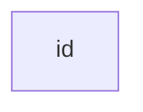
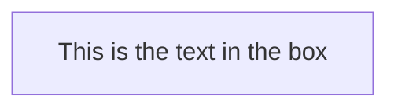
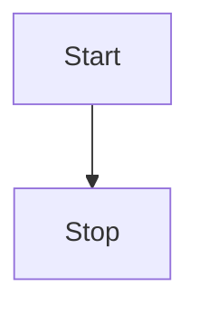
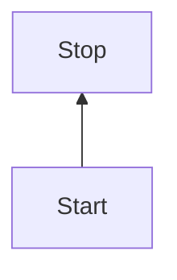
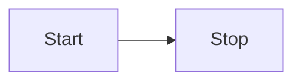
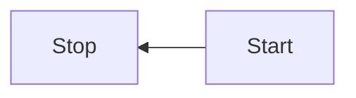
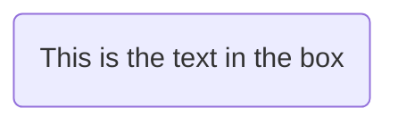
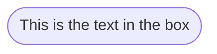
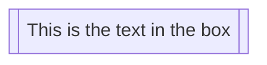
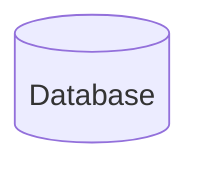

官网：https://mermaid-js.github.io/mermaid/#/

# 一. Flowcharts流程图

所有流程图都由**节点**、几何形状和**边缘**、箭头或线条组成。美人鱼代码定义了这些**节点**和**边缘的**制作和交互方式。

它还可以容纳不同的箭头类型、多方向箭头以及与子图之间的链接。

> **重要说明**：请勿键入单词“end”作为流程图节点。将所有或任何一个字母大写以防止流程图中断，即“End”或“END”。或者，您可以应用此[替代方法](https://github.com/mermaid-js/mermaid/issues/1444#issuecomment-639528897)。

## 1. 节点（默认）




> **注意**id 是框中显示的内容。

## 2. 包含文本的节点

也可以在框中设置与id不同的文本。如果多次执行此操作，则将为要使用的节点找到的最后一个文本。此外，如果稍后为节点定义边，则可以省略文本定义。在呈现框时将使用先前定义的那个。




## 3. 流程图的方向

### 3.1 从上到下：TB - top to bottom/TD - top-down




### 3.2 从下到上：BT - bottom to top



### 3.3 从左到右：LR - left to right



### 3.4 从右到左：RL - right to left




## 4. 节点形状

### 4.1 圆边节点




### 4.2 体育场形节点




### 4.3 子例程形状中的节点




### 4.4 圆柱形的节点




### 4.5 圆形节点

```mermaid-example
flowchart LR
    id1((This is the text in the circle))
```

```mermaid
flowchart LR
    id1((This is the text in the circle))
```

### 4.6 形状不对称的节点

```mermaid-example
flowchart LR
    id1>This is the text in the box]
```

```mermaid
flowchart LR
    id1>This is the text in the box]
```

Currently only the shape above is possible and not its mirror. _This might change with future releases._

### 4.7 菱形节点

```mermaid-example
flowchart LR
    id1{This is the text in the box}
```

```mermaid
flowchart LR
    id1{This is the text in the box}
```

### 4.8 六边形节点

```mermaid-example
flowchart LR
    id1{{This is the text in the box}}
```

```mermaid
flowchart LR
    id1{{This is the text in the box}}
```

### 4.9 平行四边形

```mermaid-example
flowchart TD
    id1[/This is the text in the box/]
```

```mermaid
flowchart TD
    id1[/This is the text in the box/]
```

### 4.10 反平行四边形

```mermaid-example
flowchart TD
    id1[\This is the text in the box\]
```

```mermaid
flowchart TD
    id1[\This is the text in the box\]
```

### 4.11 梯形

```mermaid-example
flowchart TD
    A[/Christmas\]
```

```mermaid
flowchart TD
    A[/Christmas\]
```

### 4.12 倒梯形

```mermaid-example
flowchart TD
    B[\Go shopping/]
```

```mermaid
flowchart TD
    B[\Go shopping/]
```

### 4.13 双圆节点

```mermaid-example
flowchart TD
    id1(((This is the text in the circle)))
```

```mermaid
flowchart TD
    id1(((This is the text in the circle)))
```

## 5. 节点之间的连接

### 5.1 带箭头的连接

```mermaid-example
flowchart LR
    A-->B
```

```mermaid
flowchart LR
    A-->B
```

**带有箭头和文本的连接**

```mermaid-example
flowchart LR
    A-->|text|B
```

```mermaid
flowchart LR
    A-->|text|B
```

or

```mermaid-example
flowchart LR
    A-- text -->B
```

```mermaid
flowchart LR
    A-- text -->B
```

### 5.2 不带箭头的连接

```mermaid-example
flowchart LR
    A --- B
```

```mermaid
flowchart LR
    A --- B
```

**带文本连接**

```mermaid-example
flowchart LR
    A-- This is the text! ---B
```

```mermaid
flowchart LR
    A-- This is the text! ---B
```

or

```mermaid-example
flowchart LR
    A---|This is the text|B
```

```mermaid
flowchart LR
    A---|This is the text|B
```

### 5.3 虚线连接

```mermaid-example
flowchart LR;
   A-.->B;
```

```mermaid
flowchart LR;
   A-.->B;
```

**带文本的虚线连接**

```mermaid-example
flowchart LR
   A-. text .-> B
```

```mermaid
flowchart LR
   A-. text .-> B
```

### 5.4 粗连接

```mermaid-example
flowchart LR
   A ==> B
```

```mermaid
flowchart LR
   A ==> B
```

**带文本的粗连接**

```mermaid-example
flowchart LR
   A == text ==> B
```

```mermaid
flowchart LR
   A == text ==> B
```

### 5.5 连接链

可以在同一行中声明许多连接，如下所示：

```mermaid-example
flowchart LR
   A -- text --> B -- text2 --> C
```

```mermaid
flowchart LR
   A -- text --> B -- text2 --> C
```

也可以在同一行中声明多个节点连接，如下所示：

```mermaid-example
flowchart LR
   a --> b & c--> d
```

```mermaid
flowchart LR
   a --> b & c--> d
```

然后，您可以以非常富有表现力的方式描述依赖项。就像下面的一行：

```mermaid-example
flowchart TB
    A & B--> C & D
```

```mermaid
flowchart TB
    A & B--> C & D
```

如果使用基本语法描述同一个图，则需要四行代码。一个警告的词，有人可能会过度使用这使流程图更难阅读的标记形式。我想到了瑞典语“lagom”。意思是，不要太多，也不要太少。这也适用于表达性语法。

```mermaid-example
flowchart TB
    A --> C
    A --> D
    B --> C
    B --> D
```

```mermaid
flowchart TB
    A --> C
    A --> D
    B --> C
    B --> D
```

### 5.6 新的箭头类型

支持以下新类型的箭头：

```mermaid-example
flowchart LR
    A --o B
    B --x C
```

```mermaid
flowchart LR
    A --o B
    B --x C
```

**多向箭头**

```mermaid-example
flowchart LR
    A o--o B
    B <--> C
    C x--x D
```

```mermaid
flowchart LR
    A o--o B
    B <--> C
    C x--x D
```

### 5.7 链接的最小长度

流程图中的每个节点最终都会根据其所链接的节点，在呈现的图形中分配一个等级，即垂直或水平级别（取决于流程图方向）。默认情况下，链接可以跨越任意数量的等级，但您可以通过在链接定义中添加额外的短划线来要求任何链接比其他链接长。

在以下示例中，在从节点 *B* 到节点 *E* 的链接中添加了两个额外的短划线，因此它比常规链接多跨越了两个等级：

```mermaid-example
flowchart TD
    A[Start] --> B{Is it?}
    B -->|Yes| C[OK]
    C --> D[Rethink]
    D --> B
    B ---->|No| E[End]
```

```mermaid
flowchart TD
    A[Start] --> B{Is it?}
    B -->|Yes| C[OK]
    C --> D[Rethink]
    D --> B
    B ---->|No| E[End]
```

> **注意**呈现引擎可能仍会创建比请求的排名数更长的连接，以适应其他请求。

当连接标签写在连接的中间时，必须在链接的右侧添加额外的破折号。以下示例与上一个示例等效：

```mermaid-example
flowchart TD
    A[Start] --> B{Is it?}
    B -- Yes --> C[OK]
    C --> D[Rethink]
    D --> B
    B -- No ----> E[End]
```

```mermaid
flowchart TD
    A[Start] --> B{Is it?}
    B -- Yes --> C[OK]
    C --> D[Rethink]
    D --> B
    B -- No ----> E[End]
```

对于虚线或粗连接，要添加的字符是等号或点，如下表所示：

| **长度**          |   1    |    2    |    3     |
| ----------------- | :----: | :-----: | :------: |
| Normal            | `---`  | `----`  | `-----`  |
| Normal with arrow | `-->`  | `--->`  | `---->`  |
| Thick             | `===`  | `====`  | `=====`  |
| Thick with arrow  | `==>`  | `===>`  | `====>`  |
| Dotted            | `-.-`  | `-..-`  | `-...-`  |
| Dotted with arrow | `-.->` | `-..->` | `-...->` |

## 6. 破坏语法的特殊字符

可以将文本放在引号内，以呈现更多麻烦的字符。如以下示例所示：

```mermaid-example
flowchart LR
    id1["This is the (text) in the box"]
```

```mermaid
flowchart LR
    id1["This is the (text) in the box"]
```

**用于转义字符的实体代码**

可以使用此处举例说明的语法对字符进行转义。

```mermaid-example
flowchart LR
    A["A double quote:#quot;"] -->B["A dec char:#9829;"]
```

```mermaid
flowchart LR
    A["A double quote:#quot;"] -->B["A dec char:#9829;"]
```

给出的数字以10为基数，因此可以被编码为。还支持使用 HTML 字符名称。`#` `#35;`

## 7. 子图

    subgraph title
        graph definition
    end

下面是一个示例：

```mermaid-example
flowchart TB
    c1-->a2
    subgraph one
    a1-->a2
    end
    subgraph two
    b1-->b2
    end
    subgraph three
    c1-->c2
    end
```

```mermaid
flowchart TB
    c1-->a2
    subgraph one
    a1-->a2
    end
    subgraph two
    b1-->b2
    end
    subgraph three
    c1-->c2
    end
```

您还可以为子图设置显式 ID。

```mermaid-example
flowchart TB
    c1-->a2
    subgraph ide1 [one]
    a1-->a2
    end
```

```mermaid
flowchart TB
    c1-->a2
    subgraph ide1 [one]
    a1-->a2
    end
```

### 7.1 连接子图

```mermaid-example
flowchart TB
    c1-->a2
    subgraph one
    a1-->a2
    end
    subgraph two
    b1-->b2
    end
    subgraph three
    c1-->c2
    end
    one --> two
    three --> two
    two --> c2
```

```mermaid
flowchart TB
    c1-->a2
    subgraph one
    a1-->a2
    end
    subgraph two
    b1-->b2
    end
    subgraph three
    c1-->c2
    end
    one --> two
    three --> two
    two --> c2
```

### 7.2 子图中的方向

使用图形类型流程图，您可以使用方向语句来设置子图将呈现的方向，如本例所示。

```mermaid-example
flowchart LR
  subgraph TOP
    direction TB
    subgraph B1
        direction RL
        i1 -->f1
    end
    subgraph B2
        direction BT
        i2 -->f2
    end
  end
  A --> TOP --> B
  B1 --> B2
```

```mermaid
flowchart LR
  subgraph TOP
    direction TB
    subgraph B1
        direction RL
        i1 -->f1
    end
    subgraph B2
        direction BT
        i2 -->f2
    end
  end
  A --> TOP --> B
  B1 --> B2
```

## 8. 互动

可以将单击事件绑定到节点，单击可以导致javascript回调或将在新的浏览器选项卡中打开的链接。**注意**:该功能在使用' securityLevel='strict' '时禁用，在使用' securityLevel='loose' '时启用。

    click nodeId callback
    click nodeId call callback()

- nodeId 是节点的标识
- callback是在显示图形的页面上定义的 javascript 函数的名称，该函数将使用 nodeId 作为参数进行调用。

工具提示用法示例如下：

```html
<script>
  var callback = function () {
    alert('A callback was triggered');
  };
</script>
```

工具提示文本用双引号括起来。工具提示的样式由类' . mermaidtooltip '设置。

```mermaid-example
flowchart LR
    A-->B
    B-->C
    C-->D
    click A callback "Tooltip for a callback"
    click B "https://www.github.com" "This is a tooltip for a link"
    click A call callback() "Tooltip for a callback"
    click B href "https://www.github.com" "This is a tooltip for a link"
```

```mermaid
flowchart LR
    A-->B
    B-->C
    C-->D
    click A callback "Tooltip for a callback"
    click B "https://www.github.com" "This is a tooltip for a link"
    click A call callback() "Tooltip for a callback"
    click B href "https://www.github.com" "This is a tooltip for a link"
```

> 工具提示功能和链接到 url 的功能从版本 0.5.2 开始提供。
>
> 由于 Docsify 处理 JavaScript 回调函数的方式存在限制，可以在[jsfiddle](https://jsfiddle.net/s37cjoau/3/) 中查看上述代码的替代工作演示。

链接默认在相同的浏览器选项卡/窗口中打开。可以通过在点击定义中添加一个链接目标来改变这一点(支持`_self`， `_blank`， `_parent`和`_top`):

```mermaid-example
flowchart LR
    A-->B
    B-->C
    C-->D
    D-->E
    click A "https://www.github.com" _blank
    click B "https://www.github.com" "Open this in a new tab" _blank
    click C href "https://www.github.com" _blank
    click D href "https://www.github.com" "Open this in a new tab" _blank
```

```mermaid
flowchart LR
    A-->B
    B-->C
    C-->D
    D-->E
    click A "https://www.github.com" _blank
    click B "https://www.github.com" "Open this in a new tab" _blank
    click C href "https://www.github.com" _blank
    click D href "https://www.github.com" "Open this in a new tab" _blank
```

初学者提示——一个在html上下文中使用交互式链接的完整示例:

```html
<body>
  <pre class="mermaid">
    flowchart LR
        A-->B
        B-->C
        C-->D
        click A callback "Tooltip"
        click B "https://www.github.com" "This is a link"
        click C call callback() "Tooltip"
        click D href "https://www.github.com" "This is a link"
  </pre>

  <script>
    var callback = function () {
      alert('A callback was triggered');
    };
    var config = {
      startOnLoad: true,
      flowchart: { useMaxWidth: true, htmlLabels: true, curve: 'cardinal' },
      securityLevel: 'loose',
    };
    mermaid.initialize(config);
  </script>
</body>
```

## 9. 注释

可以在流程图中输入注释，解析器将忽略这些注释。注释需要位于自己的行上，并且必须以`%%`（双倍百分号）开头。注释开始到下一个换行符之后的任何文本都将被视为注释，包括任何流语法。

```mermaid-example
flowchart LR
%% this is a comment A -- text --> B{node}
   A -- text --> B -- text2 --> C
```

```mermaid
flowchart LR
%% this is a comment A -- text --> B{node}
   A -- text --> B -- text2 --> C
```

## 10. 样式和类

### 10.1 连接样式

可以设置连接样式。例如，您可能希望设置在流中向后移动的连接的样式。由于连接没有与节点相同的 id，因此需要一些其他方法来决定连接应附加到哪种样式。使用在图表中定义连接时的顺序号，而不是 ids，或使用默认值应用于所有链接。在下面的示例中，linkStyle 语句中定义的样式将属于图中的第四个连接：

    linkStyle 3 stroke:#ff3,stroke-width:4px,color:red;

### 10.2 设置线条的曲线样式

如果默认方法不能满足您的需要，则可以对项目之间的线使用的曲线类型设置样式。可用的曲线样式包括`basis`, `bump`, `linear`, `monotoneX`, `monotoneY`, `natural`, `step`, `stepAfter`和`stepBefore`。

在这个例子中，从左到右的图形使用了“stepBefore”曲线样式:

    %%{ init: { 'flowchart': { 'curve': 'stepBefore' } } }%%
    graph LR

有关可用曲线的完整列表（包括自定义曲线的说明），请参阅 [d3-shape](https://github.com/d3/d3-shape/) 项目中的[“Shapes”](https://github.com/d3/d3-shape/blob/main/README.md#curves)文档。

### 10.3 设置节点样式

可以将特定样式（如较粗的边框或不同的背景色）应用于节点。

fill表示填充颜色，stroke表示边框颜色，stroke-width表示边框宽度，color表示字体颜色，stroke-dasharray表示边框样式。

```mermaid-example
flowchart LR
    id1(Start)-->id2(Stop)
    style id1 fill:#f9f,stroke:#333,stroke-width:4px
    style id2 fill:#bbf,stroke:#f66,stroke-width:2px,color:#fff,stroke-dasharray: 5 5
```

```mermaid
flowchart LR
    id1(Start)-->id2(Stop)
    style id1 fill:#f9f,stroke:#333,stroke-width:4px
    style id2 fill:#bbf,stroke:#f66,stroke-width:2px,color:#fff,stroke-dasharray: 5 5
```

### 10.4 类

比每次定义样式更方便的是定义一类样式并将该类附加到应具有不同外观的节点。

类定义如下例所示：

        classDef className fill:#f9f,stroke:#333,stroke-width:4px;

将类附加到节点的过程如下：

        class nodeId1 className;

也可以在一个语句中将类附加到节点列表：

        class nodeId1,nodeId2 className;

添加类的一种简短形式是使用`:::`操作符将类名附加到节点，如下所示:

```mermaid-example
flowchart LR
    A:::someclass --> B
    classDef someclass fill:#f96;
```

```mermaid
flowchart LR
    A:::someclass --> B
    classDef someclass fill:#f96;
```

### 10.5 Css类

也可以在css样式中预定义类，这些类可以从图形定义中应用，如下面的示例所示：

**示例样式**

```html
<style>
  .cssClass > rect {
    fill: #ff0000;
    stroke: #ffff00;
    stroke-width: 4px;
  }
</style>
```

**示例定义**

```mermaid-example
flowchart LR;
    A-->B[AAA<span>BBB</span>]
    B-->D
    class A cssClass
```

```mermaid
flowchart LR;
    A-->B[AAA<span>BBB</span>]
    B-->D
    class A cssClass
```

### 10.6 默认类

如果一个类被命名为 default，它将被分配给没有特定类定义的所有类。

        classDef default fill:#f9f,stroke:#333,stroke-width:4px;

## 11. 对fontawesome的基本支持

可以从fontawesome添加图标。

这些图标可通过语法 `fa:#icon class name#`访问。

```mermaid-example
flowchart TD
    B["fab:fa-twitter for peace"]
    B-->C[fa:fa-ban forbidden]
    B-->D(fa:fa-spinner);
    B-->E(A fa:fa-camera-retro perhaps?)
```

```mermaid
flowchart TD
    B["fab:fa-twitter for peace"]
    B-->C[fa:fa-ban forbidden]
    B-->D(fa:fa-spinner);
    B-->E(A fa:fa-camera-retro perhaps?)
```

> 美人鱼现在只与fontawesome版本4和5兼容。检查您使用的是正确版本的fontawesome。
>

## 12. 顶点和链接之间有空格且不带分号的图形声明

- 在图形声明中，语句现在也可以不带分号结束。在 0.2.16 版之后，用分号结束图形语句只是可选的。因此，下面的图声明与图的旧声明一起也是有效的。

- 顶点和链接之间允许有一个空格。但是，顶点与其文本以及链接与其文本之间不应有任何空格。图形声明的旧语法也将起作用，因此此新功能是可选的，引入该功能是为了提高可读性。

下面是图形边缘的新声明，该声明与图形边缘的旧声明一起也有效。

```mermaid-example
flowchart LR
    A[Hard edge] -->|Link text| B(Round edge)
    B --> C{Decision}
    C -->|One| D[Result one]
    C -->|Two| E[Result two]
```

```mermaid
flowchart LR
    A[Hard edge] -->|Link text| B(Round edge)
    B --> C{Decision}
    C -->|One| D[Result one]
    C -->|Two| E[Result two]
```

## 13. 配置...

是否可以调整呈现的流程图的宽度。

这是通过定义**mermaid.flowchartConfig**或通过 CLI 将 JSON 文件与配置一起使用来完成的。如何使用 CLI 在mermaidCLI页面中进行了描述。美人鱼流程图配置可以设置为具有配置参数或相应对象的 JSON 字符串。

```javascript
mermaid.flowchartConfig = {
    width: 100%
}
```
