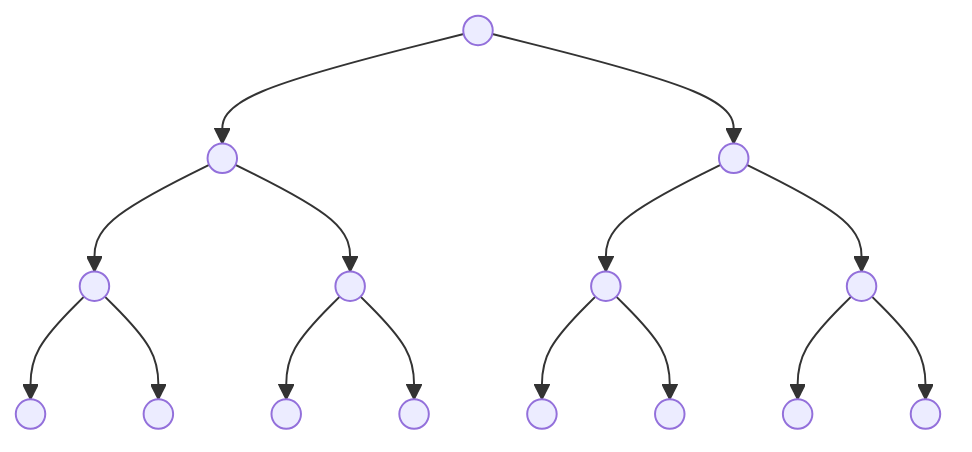

题库 - AcWing：https://www.acwing.com/problem/

# 一. 排序算法


## 1. 归并排序（Merge Sort）

归并排序是建立在归并操作上的一种有效的排序算法。该算法是采用分治法（Divide and Conquer）的一个非常典型的应用。将已有序的子序列合并，得到完全有序的序列；即先使每个子序列有序，再使子序列段间有序。若将两个有序表合并成一个有序表，称为2-路归并。 

### 1.1 算法描述

- 把长度为n的输入序列分成两个长度为n/2的子序列；
- 对这两个子序列分别采用归并排序；
- 将两个排序好的子序列合并成一个最终的排序序列。

### 1.2 动图演示


### 1.3 代码实现

将序列分成两份，分别排序后合并成一份。递归下去直到子序列只剩一个元素，或者只剩两个元素。

```c++
#include <iostream>
#include <vector>
#include <algorithm>

using namespace std;

// 申请临时容器复制数据，将合并结果放入原容器
void merge1(vector<int>& vec, int begin, int middle, int end) {
	int i = 0, j = middle - begin + 1, k = begin;
	vector<int> temp(vec.begin() + begin, vec.begin() + end + 1);
	while (i <= middle - begin && j <= end - begin) {
		if (temp[i] <= temp[j]) {
			vec[k++] = temp[i++];
		}
		else {
			vec[k++] = temp[j++];
		}
	}
	// 有一个区间处理完，另一个区间还有数据
	while (i <= middle - begin) {
		vec[k++] = temp[i++];
	}
	while (j <= end - begin) {
		vec[k++] = temp[j++];
	}
}

// 将合并结果放入临时容器，完成后拷贝到原容器
void merge2(vector<int>& vec, int begin, int middle, int end) {
	int i = begin, j = middle + 1, k = 0;
	vector<int> temp(end - begin + 1);
	while (i <= middle && j <= end) {
		if (vec[i] <= vec[j]) {
			temp[k++] = vec[i++];
		}
		else {
			temp[k++] = vec[j++];
		}
	}
	while (i <= middle) {
		temp[k++] = vec[i++];
	}
	while (j <= end) {
		temp[k++] = vec[j++];
	}
	for (i = 0; i <= end - begin; ++i) {
		vec[i + begin] = temp[i];
	}
}

void merge_sort(vector<int>& vec, int begin, int end) {
	// 递归终止条件：区间只剩一个元素
	if (begin >= end) {
		return;
	}
	int middle = (begin + end) / 2;
	// 分成两个区间分别排序，再合并
	merge_sort(vec, begin, middle);
	merge_sort(vec, middle + 1, end);
	merge2(vec, begin, middle, end);
}

int main() {
	vector<int> vec = {3, 7, 9, 2, 5, 10, 8, 4, 1, 6};
	for_each(vec.begin(), vec.end(), [](int& a) {cout << a << " "; });
	cout << endl;
	merge_sort(vec, 0, vec.size() - 1);
	for_each(vec.begin(), vec.end(), [](int& a) {cout << a << " "; });
	return 0;
}
```

## 2. 快速排序（Quick Sort）

快速排序的基本思想：通过一趟排序将待排记录分隔成独立的两部分，其中一部分记录的关键字均比另一部分的关键字小，则可分别对这两部分记录继续进行排序，以达到整个序列有序。

### 2.1 算法描述

快速排序使用分治法来把一个串（list）分为两个子串（sub-lists）。具体算法描述如下：

- 从数列中挑出一个元素，称为 “基准”（pivot）；
- 重新排序数列，所有元素比基准值小的摆放在基准前面，所有元素比基准值大的摆在基准的后面（相同的数可以到任一边）。在这个分区退出之后，该基准就处于数列的中间位置。这个称为分区（partition）操作；
- 递归地（recursive）把小于基准值元素的子数列和大于基准值元素的子数列排序。

### 2.2 动图演示


### 2.3 代码实现

找到一个分区点pivot，将小于pivot的元素放到左边，大于pivot的元素放到右边。问题缩小为排序pivot左边的元素和pivot右边的元素。

pivot随便选择，一般选择区间最后一个元素。

```c++
#include <iostream>
#include <vector>
#include <algorithm>

using namespace std;

void swap(int& a, int& b) {
	int temp = a;
	a = b;
	b = temp;
}

// 分区函数，原地处理
int partation(vector<int>& vec, int begin, int end) {
	int pivot = vec[end];
	int i = begin;
	// 遍历分区，将小于pivot的元素交换到i所在位置，i加1可保持：i左边的元素都小于pivot
	for (int j = begin; j < end; ++j) {
		if (vec[j] < pivot) {
			// 交换i和j对应的元素
			swap(vec[i], vec[j]);
			++i;
		}
	}
	// 把pivot放到它该呆的地方
	swap(vec[i], vec[end]);
	return i;
}

void quick_sort(vector<int>& vec, int begin, int end) {
	// 递归终止条件：区间只剩一个元素
	if (begin >= end) {
		return;
	}
	int piv_idx = partation(vec, begin, end);
	// 分区后解决规模更小的子问题
	quick_sort(vec, begin, piv_idx - 1);
	quick_sort(vec, piv_idx + 1, end);
}

int main() {
	vector<int> vec = {3, 7, 9, 2, 5, 10, 8, 4, 1, 6};
	for_each(vec.begin(), vec.end(), [](int& a) {cout << a << " "; });
	cout << endl;
	quick_sort(vec, 0, vec.size() - 1);
	for_each(vec.begin(), vec.end(), [](int& a) {cout << a << " "; });
	return 0;
}
```

### 2.4 查找第K大元素

方法1：利用**冒泡排序**，进行k趟排序，即可查找到第k大的数（每趟冒泡排序都寻找当前序列中的最大值）；

方法2：利用**选择排序**，进行k趟排序，即可查找到第k大的数（每趟选择排序都寻找当前序列中的最大值）

方法3：使用快速排序中的分区方法，选择数组A[0, n-1]中的最后一个元素A[n-1]作为pivot，对数组进行原地分区，数组分成3部分：A[0, p-1]、A[p]、A[p+1, n-1]。

- 如果K=p+1，那边A[p]就是第K大元素
- 如果K>p+1，说明第K大元素出现在A[p+1, n-1]中，接着查找
- 如果K<p+1，说明第K大元素出现在A[0, p-1]中，接着查找

扩展：获取前K大元素可以使用大顶堆，建一个大小为K的堆，从数组中取出元素放入堆中，如果堆满则和堆顶元素比较，小于堆顶元素则弹出堆顶元素压入当前元素，最后堆中为前K大元素。

```c++
#include <iostream>
#include <vector>
#include <algorithm>

using namespace std;

void swap(int& a, int& b) {
	int temp = a;
	a = b;
	b = temp;
}

// 分区函数，原地处理
int partation(vector<int>& vec, int begin, int end) {
	int pivot = vec[end];
	int i = begin;
	// 遍历分区，将小于pivot的元素交换到i所在位置，i加1可保持：i左边的元素都小于pivot
	for (int j = begin; j < end; ++j) {
		if (vec[j] < pivot) {
			// 交换i和j对应的元素
			swap(vec[i], vec[j]);
			++i;
		}
	}
	// 把pivot放到它该呆的地方
	swap(vec[i], vec[end]);
	return i;
}

int quick_find(vector<int>& vec, int begin, int end, int k) {
	if (begin > end) { // 区间无效
		return -1;
	}
	if (k <= begin || k > end + 1) { // k无效
		return -1;
	}
	if (begin == end) { // 区间只有一个元素
		return begin;
	}
	int piv_idx = partation(vec, begin, end);
	if (k == piv_idx + 1) {
		return piv_idx;
	}
	else if (k > piv_idx + 1) {
		return quick_find(vec, piv_idx + 1, end, k);
	}
	else {
		return quick_find(vec, begin, piv_idx - 1, k);
	}
}

int main() {
	vector<int> vec = { 3, 7, 9, 2, 5, 10, 8, 4, 1, 6 };
	for_each(vec.begin(), vec.end(), [](int& a) {cout << a << " "; });
	cout << endl;
	int k = quick_find(vec, 0, vec.size() - 1, 5);
	if (k != -1) {
		cout << "value: " << vec[k];
	}
	return 0;
}
```

## 3. 冒泡排序（Bubble Sort）

冒泡排序是一种简单的排序算法。它重复地走访过要排序的数列，一次比较两个元素，如果它们的顺序错误就把它们交换过来。走访数列的工作是重复地进行直到没有再需要交换，也就是说该数列已经排序完成。这个算法的名字由来是因为越小的元素会经由交换慢慢“浮”到数列的顶端。 

### 3.1 算法描述

- 比较相邻的元素。如果第一个比第二个大，就交换它们两个；
- 对每一对相邻元素作同样的工作，从开始第一对到结尾的最后一对，这样在最后的元素应该会是最大的数；
- 针对所有的元素重复以上的步骤，除了最后一个；
- 重复步骤1~3，直到排序完成。

### 3.2 动图演示


### 3.3 代码实现

```c++
#include <iostream>
#include <vector>
#include <algorithm>

using namespace std;

void bubbleSort(vector<int>& vec)
{
	int size = vec.size();
	int i, j, temp;
	for (i = 0; i < size - 1; ++i) {
		for (j = 0; j < size - 1 - i; ++j) {
			if (vec[j] > vec[j + 1]) {
				temp = vec[j];
				vec[j] = vec[j + 1];
				vec[j + 1] = temp;
			}
		}
	}
}

int main()
{
	vector<int> vec{ 5, 2, 4, 1, 3 };
	for_each(vec.begin(), vec.end(), [](int a) {cout << a << " "; });
	cout << endl;
	bubbleSort(vec);
	for_each(vec.begin(), vec.end(), [](int a) {cout << a << " "; });
	return 0;
}
```

## 4. 插入排序（Insertion Sort）

插入排序（Insertion-Sort）的算法描述是一种简单直观的排序算法。它的工作原理是通过构建有序序列，对于未排序数据，在已排序序列中从后向前扫描，找到相应位置并插入。

### 4.1 算法描述

一般来说，插入排序都采用in-place在数组上实现。具体算法描述如下：

- 从第一个元素开始，该元素可以认为已经被排序；
- 取出下一个元素，在已经排序的元素序列中从后向前扫描；
- 如果该元素（已排序）大于新元素，将该元素移到下一位置；
- 重复步骤3，直到找到已排序的元素小于或者等于新元素的位置；
- 将新元素插入到该位置后；
- 重复步骤2~5。

### 4.2 动图演示


### 4.3 代码实现

```c++
#include <iostream>
#include <vector>
#include <algorithm>

using namespace std;

void insertionSort(vector<int>& vec)
{
	int size = vec.size();
	int i, preIndex, current;
	for (i = 1; i < size; ++i) { // 从第二个数开始往前插入
		preIndex = i - 1;
		current = vec[i];
		while (preIndex >= 0 && vec[preIndex] > current) {
			vec[preIndex + 1] = vec[preIndex]; // 把大于current的数往后移
			--preIndex;
		}
		vec[preIndex + 1] = current; // preIndex及之前的数都小于等于current
	}
}

int main()
{
	vector<int> vec{ 5, 2, 4, 1, 3 };
	for_each(vec.begin(), vec.end(), [](int a) {cout << a << " "; });
	cout << endl;
	insertionSort(vec);
	for_each(vec.begin(), vec.end(), [](int a) {cout << a << " "; });
	return 0;
}
```

## 5. 希尔排序（Shell Sort）

1959年Shell发明，第一个突破O(n2)的排序算法，是简单插入排序的改进版。它与插入排序的不同之处在于，它会优先比较距离较远的元素。希尔排序又叫**缩小增量排序**。

### 5.1 算法描述

先将整个待排序的记录序列分割成为若干子序列分别进行直接插入排序，具体算法描述：

- 选择一个增量序列t1，t2，…，tk，其中ti>tj，tk=1；
- 按增量序列个数k，对序列进行k 趟排序；
- 每趟排序，根据对应的增量ti，将待排序列分割成若干长度为m 的子序列，分别对各子表进行直接插入排序。仅增量因子为1 时，整个序列作为一个表来处理，表长度即为整个序列的长度。

### 5.2 动图演示


### 5.3 代码实现

```javascript
// 修改于 2019-03-06
function shellSort(arr) {
    var len = arr.length;
    for (var gap = Math.floor(len / 2); gap > 0; gap = Math.floor(gap / 2)) {
        // 注意：这里和动图演示的不一样，动图是分组执行，实际操作是多个分组交替执行
        for (var i = gap; i < len; i++) {
            var j = i;
            var current = arr[i];
            while (j - gap >= 0 && current < arr[j - gap]) {
                 arr[j] = arr[j - gap];
                 j = j - gap;
            }
            arr[j] = current;
        }
    }
    return arr;
}
```

## 6. 选择排序（Selection Sort）

选择排序(Selection-sort)是一种简单直观的排序算法。它的工作原理：首先在未排序序列中找到最小（大）元素，存放到排序序列的起始位置，然后，再从剩余未排序元素中继续寻找最小（大）元素，然后放到已排序序列的末尾。以此类推，直到所有元素均排序完毕。 

### 6.1 算法描述

n个记录的直接选择排序可经过n-1趟直接选择排序得到有序结果。具体算法描述如下：

- 初始状态：无序区为R[1..n]，有序区为空；
- 第i趟排序(i=1,2,3…n-1)开始时，当前有序区和无序区分别为R[1..i-1]和R(i..n）。该趟排序从当前无序区中-选出关键字最小的记录 R[k]，将它与无序区的第1个记录R交换，使R[1..i]和R[i+1..n)分别变为记录个数增加1个的新有序区和记录个数减少1个的新无序区；
- n-1趟结束，数组有序化了。

### 6.2 动图演示


### 6.3 代码实现

```javascript
#include <iostream>
#include <vector>
#include <algorithm>

using namespace std;

void selectionSort(vector<int>& vec)
{
	int size = vec.size();
	int i, j, minIndex, temp;
	for (i = 0; i < size - 1; ++i) { // 循环n-1次
		minIndex = i;
		for (j = i + 1; j < size; ++j) { // 每次从后面的无序区找最小值的下标
			if (vec[j] < vec[minIndex]) {
				minIndex = j;
			}
		}
		temp = vec[i]; // 把最小值交换到有序区后面
		vec[i] = vec[minIndex];
		vec[minIndex] = temp;
	}
}

int main()
{
	vector<int> vec{ 5, 2, 4, 1, 3 };
	for_each(vec.begin(), vec.end(), [](int a) {cout << a << " "; });
	cout << endl;
	selectionSort(vec);
	for_each(vec.begin(), vec.end(), [](int a) {cout << a << " "; });
	return 0;
}
```

## 7. 堆排序（Heap Sort）

堆排序（Heapsort）是指利用堆这种数据结构所设计的一种排序算法。堆积是一个近似完全二叉树的结构，并同时满足堆积的性质：即子结点的键值或索引总是小于（或者大于）它的父节点。

### 7.1 算法描述

- 将初始待排序关键字序列(R1,R2….Rn)构建成大顶堆，此堆为初始的无序区；
- 将堆顶元素R[1]与最后一个元素R[n]交换，此时得到新的无序区(R1,R2,……Rn-1)和新的有序区(Rn),且满足R[1,2…n-1]<=R[n]；
- 由于交换后新的堆顶R[1]可能违反堆的性质，因此需要对当前无序区(R1,R2,……Rn-1)调整为新堆，然后再次将R[1]与无序区最后一个元素交换，得到新的无序区(R1,R2….Rn-2)和新的有序区(Rn-1,Rn)。不断重复此过程直到有序区的元素个数为n-1，则整个排序过程完成。

### 7.2 动图演示


### 7.3 代码实现

```javascript
var len;    // 因为声明的多个函数都需要数据长度，所以把len设置成为全局变量
 
function buildMaxHeap(arr) {   // 建立大顶堆
    len = arr.length;
    for (var i = Math.floor(len/2); i >= 0; i--) {
        heapify(arr, i);
    }
}
 
function heapify(arr, i) {     // 堆调整
    var left = 2 * i + 1,
        right = 2 * i + 2,
        largest = i;
 
    if (left < len && arr[left] > arr[largest]) {
        largest = left;
    }
 
    if (right < len && arr[right] > arr[largest]) {
        largest = right;
    }
 
    if (largest != i) {
        swap(arr, i, largest);
        heapify(arr, largest);
    }
}
 
function swap(arr, i, j) {
    var temp = arr[i];
    arr[i] = arr[j];
    arr[j] = temp;
}
 
function heapSort(arr) {
    buildMaxHeap(arr);
 
    for (var i = arr.length - 1; i > 0; i--) {
        swap(arr, 0, i);
        len--;
        heapify(arr, 0);
    }
    return arr;
}
```

## 8. 计数排序（Counting Sort）

计数排序不是基于比较的排序算法，其核心在于将输入的数据值转化为键存储在额外开辟的数组空间中。 作为一种线性时间复杂度的排序，计数排序要求输入的数据必须是有确定范围的整数。

### 8.1 算法描述

- 找出待排序的数组中最大和最小的元素；
- 统计数组中每个值为i的元素出现的次数，存入数组C的第i项；
- 对所有的计数累加（从C中的第一个元素开始，每一项和前一项相加）；
- 反向填充目标数组：将每个元素i放在新数组的第C(i)项，每放一个元素就将C(i)减去1。

### 8.2 动图演示


### 8.3 代码实现

```javascript
function countingSort(arr, maxValue) {
    var bucket = new Array(maxValue + 1),
        sortedIndex = 0;
        arrLen = arr.length,
        bucketLen = maxValue + 1;
 
    for (var i = 0; i < arrLen; i++) {
        if (!bucket[arr[i]]) {
            bucket[arr[i]] = 0;
        }
        bucket[arr[i]]++;
    }
 
    for (var j = 0; j < bucketLen; j++) {
        while(bucket[j] > 0) {
            arr[sortedIndex++] = j;
            bucket[j]--;
        }
    }
 
    return arr;
}
```

### 8.4 算法分析

计数排序是一个稳定的排序算法。当输入的元素是 n 个 0到 k 之间的整数时，时间复杂度是O(n+k)，空间复杂度也是O(n+k)，其排序速度快于任何比较排序算法。当k不是很大并且序列比较集中时，计数排序是一个很有效的排序算法。

## 9. 桶排序（Bucket Sort）

桶排序是计数排序的升级版。它利用了函数的映射关系，高效与否的关键就在于这个映射函数的确定。桶排序 (Bucket sort)的工作的原理：假设输入数据服从均匀分布，将数据分到有限数量的桶里，每个桶再分别排序（有可能再使用别的排序算法或是以递归方式继续使用桶排序进行排）。

### 9.1 算法描述

- 设置一个定量的数组当作空桶；
- 遍历输入数据，并且把数据一个一个放到对应的桶里去；
- 对每个不是空的桶进行排序；
- 从不是空的桶里把排好序的数据拼接起来。 

### 9.2 图片演示


### 9.3 代码实现

```javascript
function bucketSort(arr, bucketSize) {
    if (arr.length === 0) {
      return arr;
    }
 
    var i;
    var minValue = arr[0];
    var maxValue = arr[0];
    for (i = 1; i < arr.length; i++) {
      if (arr[i] < minValue) {
          minValue = arr[i];                // 输入数据的最小值
      } else if (arr[i] > maxValue) {
          maxValue = arr[i];                // 输入数据的最大值
      }
    }
 
    // 桶的初始化
    var DEFAULT_BUCKET_SIZE = 5;            // 设置桶的默认数量为5
    bucketSize = bucketSize || DEFAULT_BUCKET_SIZE;
    var bucketCount = Math.floor((maxValue - minValue) / bucketSize) + 1;  
    var buckets = new Array(bucketCount);
    for (i = 0; i < buckets.length; i++) {
        buckets[i] = [];
    }
 
    // 利用映射函数将数据分配到各个桶中
    for (i = 0; i < arr.length; i++) {
        buckets[Math.floor((arr[i] - minValue) / bucketSize)].push(arr[i]);
    }
 
    arr.length = 0;
    for (i = 0; i < buckets.length; i++) {
        insertionSort(buckets[i]);                      // 对每个桶进行排序，这里使用了插入排序
        for (var j = 0; j < buckets[i].length; j++) {
            arr.push(buckets[i][j]);                     
        }
    }
 
    return arr;
}
```

### 9.4 算法分析

桶排序最好情况下使用线性时间O(n)，桶排序的时间复杂度，取决与对各个桶之间数据进行排序的时间复杂度，因为其它部分的时间复杂度都为O(n)。很显然，桶划分的越小，各个桶之间的数据越少，排序所用的时间也会越少。但相应的空间消耗就会增大。 

## 10. 基数排序（Radix Sort）

基数排序是按照低位先排序，然后收集；再按照高位排序，然后再收集；依次类推，直到最高位。有时候有些属性是有优先级顺序的，先按低优先级排序，再按高优先级排序。最后的次序就是高优先级高的在前，高优先级相同的低优先级高的在前。

### 10.1 算法描述

- 取得数组中的最大数，并取得位数；
- arr为原始数组，从最低位开始取每个位组成radix数组；
- 对radix进行计数排序（利用计数排序适用于小范围数的特点）；

### 10.2 动图演示

 

### 10.3 代码实现

```javascript
var counter = [];
function radixSort(arr, maxDigit) {
    var mod = 10;
    var dev = 1;
    for (var i = 0; i < maxDigit; i++, dev *= 10, mod *= 10) {
        for(var j = 0; j < arr.length; j++) {
            var bucket = parseInt((arr[j] % mod) / dev);
            if(counter[bucket]==null) {
                counter[bucket] = [];
            }
            counter[bucket].push(arr[j]);
        }
        var pos = 0;
        for(var j = 0; j < counter.length; j++) {
            var value = null;
            if(counter[j]!=null) {
                while ((value = counter[j].shift()) != null) {
                      arr[pos++] = value;
                }
          }
        }
    }
    return arr;
}
```

### 10.4 算法分析

基数排序基于分别排序，分别收集，所以是稳定的。但基数排序的性能比桶排序要略差，每一次关键字的桶分配都需要O(n)的时间复杂度，而且分配之后得到新的关键字序列又需要O(n)的时间复杂度。假如待排数据可以分为d个关键字，则基数排序的时间复杂度将是O(d*2n) ，当然d要远远小于n，因此基本上还是线性级别的。

基数排序的空间复杂度为O(n+k)，其中k为桶的数量。一般来说n>>k，因此额外空间需要大概n个左右。

## 11. 全排列问题

### 11.1 C++算法

```c++
#include <iostream>
#include <vector>
#include <algorithm>

using namespace std;

int main()
{
	vector<int> items{3, 5, 2, 4, 1};
	sort(items.begin(), items.end());
	do {
		for_each(items.begin(), items.end(), [](int& a) {cout << a << " "; });
		cout << endl;
	} while (next_permutation(items.begin(), items.end()));
	return 0;
}
```

next_permutation实现原理：

以长度为n的数组w为例，其中每个元素均不相同

目标：找到当前序列的下一个序列（字典序，从小到大）

如果某一子序列已经是降序排列，说明该序列已经是最大字典序

- 步骤1：从序列末端找出长度最大的降序连续子序列

- 步骤2：在该子序列中找出刚好大于与该子序列左端相邻的元素，并交换（使序列变大的幅度最小）

- 步骤3：将交换后的子序列逆序

```c++
int w[] = {1, 2, 5, 4, 3, 1};
int k = n - 1;
while (w[k - 1] > w[k]) k -- ; //步骤1：k=2指向5,5后的元素都是逆序的
int t = n - 1;
while (w[t] < w[k - 1]) t -- ; // k-1对应的元素为2，从后往前找大于2的元素3，此时t=4
swap(w[k - 1], w[t]); //步骤2：交换2和3
reverse(w + k, w + n); //步骤3：逆序k及以后的元素，结果为1, 3, 1, 2, 4, 5
```

模板实现：

```c++
#include <iostream>
#include <vector>
#include <algorithm>

using namespace std;

template <typename T>
bool Next_permutation(T first, T last) {
	if (first == last || first + 1 == last) {
		return false; // 空区间 或 1个元素
	}

	T pre = last - 2;
	T cur = last - 1;
	while (1) {
		// 逆序找出第一个 *pre<*cur;
		if (*pre < *cur) {
			T j = last;
			while (!(*--j > *pre )); // 倒序找到第一个比*pre大的元素
			iter_swap(pre, j); // 交换*pre，*j
			reverse(cur, last); // cur之后的全部逆序
			return true;
		}
		if (pre == first) { // 进行到最前面了，返回false
			// reverse(first, last); // 不需要全部逆序到初始状态
			return false;
		}
		pre--;
		cur--;
	}
}

template <typename T>
bool Prev_permutation(T first, T last) {
	if (first == last || first + 1 == last) {
		return false; // 空区间 或 1个元素
	}

	T pre = last - 2;
	T cur = last - 1;
	while (1) {
		// 逆序找出第一个 *pre>*cur(递减);
		if (*pre > *cur) {
			T j = last;
			while (!(*--j < *pre)); // 倒序找到第一个比*pre小的元素
			iter_swap(pre, j); // 交换*pre，*j
			reverse(cur, last); // cur之后的全部逆序
			return true;
		}
		if (pre == first) { // 进行到最前面了，返回false
			// reverse(first, last); // 不需要全部逆序到初始状态
			return false;
		}
		pre--;
		cur--;
	}
}

int main()
{
	cout << "Next_permutation:" << endl;
	vector<int> v{1, 2, 3};
	do {
		for (auto x : v) {
			cout << x << " ";
		}
		cout << endl;
	} while (Next_permutation(v.begin(), v.end()));

	cout << endl << "Prev_permutation:" << endl;
	sort(v.begin(), v.end(), greater<int>());
	do {
		for (auto x : v) {
			cout << x << " ";
		}
		cout << endl;
	} while (Prev_permutation(v.begin(), v.end()));
	return 0;
}
```

### 11.2 回溯

```c++
#include <iostream>
#include <vector>
#include <algorithm>

using namespace std;

int n = 0;

void swap(int& a, int& b)
{
	int m = a;
	a = b;
	b = m;
}

void perm(vector<int>& vec, int left, int right)
{
	if (left < right)
	{
		for (int i = left; i <= right; ++i)
		{
			swap(vec[left], vec[i]);
			perm(vec, left + 1, right);
			swap(vec[left], vec[i]);
		}
	}
	else
	{
		for_each(vec.begin(), vec.end(), [](auto a) {cout << a << " "; });
		cout << endl;
		n++;
	}
}

int main()
{
	vector<int> vec{ 1, 2, 3, 4 };
	perm(vec, 0, vec.size() - 1);
	cout << "total: " << n << endl;
	return 0;
}
```

### 11.3 变种

类似字符串这种某个元素是另一个元素的组成部分时，会出现重复，例如"a b ab c"和“ab a b c”组成的字符串有重复。

需要用set去重，unordered_set也能去重，但是内部排序是混乱的，set内部会自动按字典序排列(与插入的顺序无关)。

```c++
#include <iostream>
#include <string>
#include <vector>
#include <set>
#include <algorithm>

using namespace std;

set<string> res;

void swap(string& a, string& b)
{
	string m = a;
	a = b;
	b = m;
}

void perm(vector<string>& vec, int left, int right)
{
	if (left < right)
	{
		for (int i = left; i <= right; ++i)
		{
			swap(vec[left], vec[i]);
			perm(vec, left + 1, right);
			swap(vec[left], vec[i]);
		}
	}
	else
	{
		string cat;
		for_each(vec.begin(), vec.end(), [&cat](auto a) { cat+=a; });
		res.emplace(cat);
	}
}

int main()
{
	vector<string> vec{ "a", "b", "ab", "c" };
	perm(vec, 0, vec.size() - 1);
	for_each(res.begin(), res.end(), [](auto a) { cout << a << endl; });
	cout << "total: " << res.size() << endl;
	return 0;
}
```

# 二. 线性结构

缓存淘汰算法，常见的有三种：先进先出（Fist In，First Out，FIFO）、最少使用（Least Frequently Used，LFU）、最近最少使用（Least Recently Used，LRU）。

# 三. 树

## 1. 二叉树

二叉树：最多只有两个子节点的树

```mermaid
graph TB
A1(( ))-->A2(( ))
A1-->A3(( ))
A2-->A4(( ))
A2-->A5(( ))
A3-->A6(( ))
A3-->A7(( ))
A4-->A8(( ))
A4-->A9(( ))
A9-->A10(( ))
A9-->A11(( ))
%% 最后定义样式
classDef className fill:#f100,stroke-width:0px; %% 设置填充白色，边框宽度为0
class A5,A7 className;
linkStyle 3,5 stroke:#0ff,stroke-width:0px %% 将连接线的宽度设置为0
```

满二叉树：叶子节点全都在最底层，除了叶子节点之外，每个节点都有左右两个子节点。



完全二叉树：叶子节点分布在最下面一层和倒数第二层，叶子节点靠左排列。

```mermaid
graph TB
A1((1))-->A2((2))
A1-->A3((3))
A2-->A4((4))
A2-->A5((5))
A3-->A6((6))
A3-->A7((7))
A4-->A8((8))
A4-->A9((9))
A5-->A10((10))
A5-->A11(( ))
classDef className fill:#f100,stroke-width:0px; %% 设置填充白色，边框宽度为0
class A11 className;
linkStyle 9 stroke:#0ff,stroke-width:0px %% 将连接线的宽度设置为0
```

### 1.1 二叉树的存储

基于指针的链式存储：常用

```c++
typedef struct BiTNode {
	int data; // 数据域
	struct BiTNode *lchild, *rchild; // 左右孩子指针
	BiTNode():data(0), lchild(nullptr), rchild(nullptr) {};
} BiTNode, *BiTree;
```

基于数组的顺序存储：不常用，不需要存储指针，节省内存。非完全二叉树会浪费数组存储空间。

根节点下标从1开始，如果节点X存储下标为i，则左子节点下标为2i，右子节点下标为2i+1，父节点下标为i/2。

根节点下标从0开始，如果节点X存储下标为i，则左子节点下标为2i+1，右子节点下标为2*(i+1)，父节点下标为(i-1)/2。

### 1.2 二叉树的遍历

前序遍历：对于树中的任意节点，先输出自己，再输出左子节点，最后输出右子节点。

中序遍历：对于树中的任意节点，先输出左子节点，再输出自己，最后输出右子节点。

后序遍历：对于树中的任意节点，先输出左子节点，再输出右子节点，最后输出自己。

层序遍历：一层一层从左到右输出。

递归：

```c++
#include <iostream>
#include <queue>

using namespace std;

typedef struct BiTNode {
	int data; // 数据域
	struct BiTNode *lchild, *rchild; // 左右孩子指针
	BiTNode():data(0), lchild(nullptr), rchild(nullptr) {};
} BiTNode, *BiTree;

//初始化树的函数
void CreateBiTree(BiTree* T) {
	*T = new BiTNode();
	(*T)->data = 1;
	(*T)->lchild = new BiTNode();
	(*T)->rchild = new BiTNode();

	(*T)->lchild->data = 2;
	(*T)->lchild->lchild = new BiTNode();
	(*T)->lchild->rchild = new BiTNode();
	(*T)->lchild->rchild->data = 5;
	(*T)->lchild->rchild->lchild = NULL;
	(*T)->lchild->rchild->rchild = NULL;
	(*T)->rchild->data = 3;
	(*T)->rchild->lchild = new BiTNode();
	(*T)->rchild->lchild->data = 6;
	(*T)->rchild->lchild->lchild = NULL;
	(*T)->rchild->lchild->rchild = NULL;
	(*T)->rchild->rchild = new BiTNode();
	(*T)->rchild->rchild->data = 7;
	(*T)->rchild->rchild->lchild = NULL;
	(*T)->rchild->rchild->rchild = NULL;
	(*T)->lchild->lchild->data = 4;
	(*T)->lchild->lchild->lchild = NULL;
	(*T)->lchild->lchild->rchild = NULL;
}

// 先序遍历
void PreOrderTraverse(BiTree T) {
	if (T) {
		cout << T->data << " ";
		PreOrderTraverse(T->lchild);
		PreOrderTraverse(T->rchild);
	}
	// 如果结点为空，返回上一层
	return;
}

//中序遍历
void MidOrderTraverse(BiTree T) {
	if (T) {
		PreOrderTraverse(T->lchild);
		cout << T->data << " ";
		PreOrderTraverse(T->rchild);
	}
	return;
}

// 后序遍历
void LastOrderTraverse(BiTree T) {
	if (T) {
		PreOrderTraverse(T->lchild);
		PreOrderTraverse(T->rchild);
		cout << T->data << " ";
	}
	return;
}

// 按层遍历
void LayerOrderTraverse(BiTree T) {
	if (!T) {
		return;
	}
	queue<BiTree> que;
	que.push(T);
	while (!que.empty()) {
		BiTree root = que.front();
		que.pop();
		cout << root->data << " ";
		que.push(root->lchild);
		que.push(root->rchild);
	}
}

int main() {
	BiTree Tree;
	CreateBiTree(&Tree);
	cout << "先序遍历: ";
	PreOrderTraverse(Tree);
	cout << endl << "中序遍历: ";
	MidOrderTraverse(Tree);
	cout << endl << "后序遍历: ";
	LastOrderTraverse(Tree);
	cout << endl << "按层遍历: ";
	LayerOrderTraverse(Tree);
	return 0;
}
```

非递归：

```c++

```

### 1.3 平衡二叉查找树

二叉查找树：左叶子节点永远小于自己，右叶子节点永远大于自己。查找的时间复杂度为O(logn)，在插入和删除过程中，会退化成链，效率大大降低。

平衡二叉查找树：任意节点左右子树的高度相差不能大于1。插入删除后调整到平衡状态会有所消耗。

红黑数：不需完全平衡，从而提高性能。需满足以下4个要求：

- 根节点是黑色的；
- 每个叶子节点都是黑色的空节点，也就是说，叶子节点不存储数据；
- 任何上下相邻的节点不能同时为红色，也就是说，红色节点被黑色节点隔开；
- 对于每个节点，从该节点到其叶子节点的所有路径，都包涵相同书目的黑色节点。

# 四. 图

## 1. 广度优先搜索和深度优先搜索

广度优先搜索（Breadth First Search，BFS）：找到的路径是最短路径

深度优先搜索（Depth First Search，DFS）：找到的路径不一定是最短路径

```c++
#include <iostream>
#include <vector>
#include <list>
#include <queue>
#include <algorithm>

using namespace std;

// 定义图
class Graph {
public:
	Graph(int v) {
		this->v = v;
		adj.resize(v);
	}
	void addEdge(int s, int t) {
		adj[s].emplace_back(t);
		adj[t].emplace_back(s);
	}
	void init();
	void bfs(int s, int t); // 广度优先搜索
	void dfs(int s, int t); // 深度优先搜索
	void print(vector<int>& prev, int s, int t); // 递归输出s到t的路径
private:
	void recurDfs(int s, int t, vector<bool>& visited, vector<int>& prev);

	int v; // 顶点个数
	vector<list<int>> adj; // 邻接表
	bool found;
};

void Graph::init()
{
	addEdge(0, 1);
	addEdge(1, 2);
	addEdge(0, 3);
	addEdge(1, 4);
	addEdge(2, 5);
	addEdge(3, 4);
	addEdge(4, 5);
	addEdge(4, 6);
	addEdge(5, 7);
	addEdge(6, 7);
}

void Graph::bfs(int s, int t)
{
	if (s == t) {
		return;
	}
	vector<bool> visited(v, false); // 记录访问过得
	visited[s] = true;
	vector<int> prev(v, -1); // 记录路径
	queue<int> queue;
	queue.push(s);
	while (!queue.empty()) {
		int w = queue.front();
		queue.pop();
		for (int& q : adj[w]) {
			if (!visited[q]) {
				prev[q] = w;
				if (q == t) {
					print(prev, s, t);
					return;
				}
				visited[q] = true;
				queue.push(q);
			}
		}
	}
}

void Graph::dfs(int s, int t)
{
	found = false;
	vector<bool> visited(v, false); // 记录访问过的
	vector<int> prev(v, -1); // 记录路径
	recurDfs(s, t, visited, prev);
	print(prev, s, t);
}

void Graph::recurDfs(int w, int t, vector<bool>& visited, vector<int>& prev)
{
	if (found) {
		return;
	}
	visited[w] = true;
	if (w == t) {
		found = true;
		return;
	}
	for (int& q : adj[w]) {
		if (!visited[q]) {
			prev[q] = w;
			recurDfs(q, t, visited, prev);
		}
	}
}
void Graph::print(vector<int>& prev, int s, int t)
{
	if (prev[t] != -1 && t != s) {
		print(prev, s, prev[t]);
	}
	cout << t << " ";
}

int main() {
	Graph graph(8);
	graph.init();
	graph.bfs(0, 6);
	cout << endl;
	graph.dfs(0, 6);
	return 0;
}
// 0 1 4 6
// 0 1 2 5 4 6
```

# 五. 贪心、分治、回溯和动态规划

## 1. 背包问题

资料：https://blog.csdn.net/weixin_42638946/article/details/114028588

- 背包问题代表了一类问题，即**组合类的最优化问题**，就是如果给我们一堆物品（元素），我们要按照某种限从中选出若干个物品（元素），求最大/最小值。
- 背包问题是一类典型的动态规划问题，一般对于动态规划问题，常规分析方式是给出`状态定义`和`状态转移`，这里为了更加容易理解，采用yxc提出的`闫式dp分析法`。

### 1.1 01背包问题

有 N 件物品和一个容量是 V 的背包。**每件物品只能使用一次**。

第 i 件物品的体积是 v<sub>i</sub>，价值是 w<sub>i</sub>。

求解将哪些物品装入背包，可使这些物品的总体积不超过背包容量，且总价值最大。
输出最大价值。

**输入格式**

第一行两个整数：N、V，用空格隔开，分别表示物品数量和背包容积。

接下来有 N 行，每行两个整数 v<sub>i</sub>、w<sub>i</sub>，用空格隔开，分别表示第 i 件物品的体积和价值。

**输出格式**

输出一个整数，表示最大价值。

**数据范围**

0<N,V≤1000
0<v<sub>i</sub>,w<sub>i</sub>≤1000

**输入输出**

```tex
4 5
1 2
2 4
3 4
4 5

8
```

#### 1.1.1 分析


#### 1.1.2 代码

```c++
#include <iostream>

using namespace std;

const int N = 1010;  // 多开几个数据，防止数组下标越界

int n, m;  // 物品种类数，背包容积
int v[N], w[N];  // 体积，价值。注意：v[1]存储第一件物品，索引0未使用
int f[N][N];  // dp数组

int main() {
	// 读入数据
	cin >> n >> m;
	for (int i = 1; i <= n; i++) cin >> v[i] >> w[i];

	// 算法过程，因为f[0][0~m]初始就为0，因此初始化可以省略
	for (int i = 1; i <= n; i++) {  // 先循环物品
		for (int j = 0; j <= m; j++) {  // 再循环容量
			// 最后循环决策
			f[i][j] = f[i - 1][j];  // 不选第i件物品
			if (j >= v[i]) f[i][j] = max(f[i][j], f[i - 1][j - v[i]] + w[i]);  // 考虑选第i件物品
		}
	}
	cout << f[n][m] << endl; // 此处不能直接输出，不超过m不一定就是m
	return 0;
}
```

- 考虑到在计算 f 的时候，当计算第 i 行时，只用到了第 i - 1 行的数据，因此可以用滚动数组优化

```c++
#include <iostream>

using namespace std;

const int N = 1010;

int n, m;
int v[N], w[N];
int f[2][N];

int main() {

	cin >> n >> m;
	for (int i = 1; i <= n; i++) cin >> v[i] >> w[i];

	for (int i = 1; i <= n; i++) {
		for (int j = 0; j <= m; j++) {
			f[i & 1][j] = f[(i - 1) & 1][j];
			if (j >= v[i]) f[i & 1][j] = max(f[i & 1][j], f[(i - 1) & 1][j - v[i]] + w[i]);
		}
	}
	cout << f[n & 1][m] << endl;
	return 0;
}
```

- 其实这里还可以将 f 数组优化为一维数组，但是考虑到要用到上一行数据，因此第二层循环应该从大到小进行遍历，这样每次更新用到的就是未被更新的数据

```c++
#include <iostream>

using namespace std;

const int N = 1010;

int n, m;
int v[N], w[N];
int f[N];

int main() {

	cin >> n >> m;
	for (int i = 1; i <= n; i++) cin >> v[i] >> w[i];

	for (int i = 1; i <= n; i++)
		for (int j = m; j >= v[i]; j--)
			f[j] = max(f[j], f[j - v[i]] + w[i]);

	cout << f[m] << endl;
	return 0;
}
```

### 1.2 完全背包问题

有 N 种物品和一个容量是 V 的背包，**每种物品都有无限件可用**。

第 i 种物品的体积是 v<sub>i</sub>，价值是 w<sub>i</sub>。

求解将哪些物品装入背包，可使这些物品的总体积不超过背包容量，且总价值最大。
输出最大价值。

**输入格式**

第一行两个整数：N、V，用空格隔开，分别表示物品数量和背包容积。

接下来有 N 行，每行两个整数 v<sub>i</sub>、w<sub>i</sub>，用空格隔开，分别表示第 i 件物品的体积和价值。

**输出格式**

输出一个整数，表示最大价值。

**数据范围**

0<N,V≤1000
0<v<sub>i</sub>,w<sub>i</sub>≤1000

**输入输出**

```
4 5
1 2
2 4
3 4
4 5

10
```

#### 1.2.1 分析


#### 1.2.2 代码

```c++
#include <iostream>

using namespace std;

const int N = 1010;

int n, m;
int v[N], w[N];
int f[N][N];

// TLE
int main() {

	cin >> n >> m;
	for (int i = 1; i <= n; i++) cin >> v[i] >> w[i];

	for (int i = 1; i <= n; i++)  // 先循环物品
		for (int j = 0; j <= m; j++)  // 再循环容量
			for (int k = 0; k * v[i] <= j; k++)  // 最后循环决策
				f[i][j] = max(f[i][j], f[i - 1][j - k * v[i]] + k * w[i]);
	cout << f[n][m] << endl;
	return 0;
}
```

- 我们可以将 f ( i , j ) = f ( i − 1 , j − k ∗ v [ i ] ) + k ∗ w [ i ] f(i, j) = f(i-1, j-k*v[i]) + k*w[i]f(i,j)=f(i−1,j−k∗v[i])+k∗w[i] 展开，就可以发现如下规律：


因此代码可以根据 f ( i , j ) = m a x ( f ( i − 1 , j ) , f ( i , j − v ) + w ) f(i, j) = max( f(i-1, j), f(i, j-v) + w)f(i,j)=max(f(i−1,j),f(i,j−v)+w) 进行优化：

```c++
#include <iostream>

using namespace std;

const int N = 1010;

int n, m;
int v[N], w[N];
int f[N][N];

int main() {

	cin >> n >> m;
	for (int i = 1; i <= n; i++) cin >> v[i] >> w[i];

	for (int i = 1; i <= n; i++)
		for (int j = 0; j <= m; j++) {
			f[i][j] = f[i - 1][j];
			if (j >= v[i]) f[i][j] = max(f[i][j], f[i][j - v[i]] + w[i]);
		}
	cout << f[n][m] << endl;
	return 0;
}
```

- 这里还可以将 f 数组优化为一维数组，因为不需要用到上一行数据，要用到本行之前计算出来的户籍，因此第二层循环应该从小到大进行遍历

```c++
#include <iostream>

using namespace std;

const int N = 1010;

int n, m;
int v[N], w[N];
int f[N];

int main() {

    cin >> n >> m;
    for (int i = 1; i <= n; i++) cin >> v[i] >> w[i];

    for (int i = 1; i <= n; i++)
        for (int j = v[i]; j <= m; j++)
            f[j] = max(f[j], f[j - v[i]] + w[i]);
    cout << f[m] << endl;
    return 0;
}
```

### 1.3 多重背包问题

有 N 种物品和一个容量是 V 的背包。

**第 i 种物品最多有 s<sub>i</sub> 件**，每件体积是 v<sub>i</sub>，价值是 w<sub>i</sub>。

求解将哪些物品装入背包，可使物品体积总和不超过背包容量，且价值总和最大。
输出最大价值。

**输入格式**

第一行两个整数，N、V，用空格隔开，分别表示物品种数和背包容积。

接下来有 N 行，每行三个整数  v<sub>i</sub> 、 w<sub>i</sub> 、 s<sub>i</sub> ，用空格隔开，分别表示第 i 种物品的体积、价值和数量。

**输出格式**

输出一个整数，表示最大价值。

**数据范围**

0<N,V≤100
0<v<sub>i</sub>,w<sub>i</sub>,s<sub>i</sub>≤100

**输入输出**

```
4 5
1 2 3
2 4 1
3 4 3
4 5 2

10
```

#### 1.3.1 分析


#### 1.3.2 代码

```c++
#include <iostream>

using namespace std;

const int N = 110;

int n, m;
int v[N], w[N], s[N];
int f[N][N];

int main() {

	cin >> n >> m;
	for (int i = 1; i <= n; i++) cin >> v[i] >> w[i] >> s[i];

	for (int i = 1; i <= n; i++)  // 先循环物品
		for (int j = 0; j <= m; j++)  // 再循环容量
			for (int k = 0; k <= s[i] && k * v[i] <= j; k++)  // 最后循环决策
				f[i][j] = max(f[i][j], f[i - 1][j - k * v[i]] + k * w[i]);
	cout << f[n][m] << endl;
	return 0;
}
```

#### 1.3.3  二进制优化方法

如果背包的规模如下，请进行优化：

0<N≤1000
0<V≤2000
0<v<sub>i</sub>,w<sub>i</sub>,s<sub>i</sub>≤2000

##### 1.3.3.1 分析

- 这一题不能使用类似于完全背包问题的方式进行优化，可以将 `f(i, j) = f(i − 1, j − k ∗ v) + k ∗ w, k = 0, 1, . . . , s` 展开，如下：


我们发现 f [ i , j − v ] 中比 f [ i,  j ]最后多了一项，不能直接得到这两者的关系，所以不能使用类似于完全背包问题的方式进行优化。

- 本次的优化方式为二进制优化，**将s件物品进行拆分，然后可以转化成01背包问题**

```c++
/*
例如 s=10
10可以拆分为0、1、2、4、3；
前四个数可以凑出0~7之间的任何数据，加上3可以凑出3~10之间的任何数据，因此这5个数可以凑出0~10内的任何数据；
相当于将10个物品打包成4个物品，打包后的物品的体积和价值分别为单个物品的1、2、4、3倍；
这四个物品都是可选可不选，因此就转化成了01背包问题。

例如 s=200
200可以拆分为0、1、2、4、8、16、32、64、73；
一共8个物品

总结：对于s，可以划分为 log(s) 上取整个单一物品，然后用01背包问题的思路解决即可，时间复杂度：O(N*V*log(s))
*/
```

##### 1.3.3.2 代码

```c++
#include <iostream>
#include <vector>

using namespace std;

const int N = 2010;

int n, m;
int f[N];

struct Good {
	int v, w;
};

int main()
{
	vector<Good> goods;
	cin >> n >> m;
	for (int i = 0; i < n; i++) {
		int v, w, s;
		cin >> v >> w >> s;
		for (int k = 1; k <= s; k *= 2) {
			s -= k;
			goods.push_back({ k * v, k * w });
		}
		if (s > 0) goods.push_back({ s * v, s * w });
	}

	for (auto good : goods)
		for (int j = m; j >= good.v; j--)
			f[j] = max(f[j], f[j - good.v] + good.w);
	cout << f[m] << endl;
	return 0;
}
```

#### 1.3.4  单调队列优化方法

如果背包的规模如下，请进行优化：

0<N≤1000
0<V≤20000
0<v<sub>i</sub>,w<sub>i</sub>,s<sub>i</sub>≤20000

##### 1.3.4.1 分析

- DP分析和 **多重背包问题 I** 完全一致，但是本题的数据量更大，需要进一步优化，这里采用滑动窗口求最值的方式优化


还有一个问题需要解决，就是窗口每次向右滑动一格，除了滑出窗口外的元素，其余的元素在下一次比较中都需要加上一个偏移量w，这个问题可以通过如下方式解决（[参考网址](https://www.acwing.com/solution/content/26583/)）：

```c++
/*
因为每次循环都只需要用到第i-1层的结果,所以在这里:
g:第i-1层结果
f:第i层结果

如果一共有3个物品，即s=3的话:
取r=1，那么f[3*v+1]的最大值为 f[3*v+1] = max(g[3*v+1], g[2*v+1]+w, g[v+1]+2w, g[1]+3w);


所以我们可以得到下列算式:(其中r表示余数)
f[r]=       g[r];
f[r+v]= max(g[r] + w,  g[r+v]);
f[r+2v]=max(g[r] + 2w, g[r+v] + w,  g[r+2v],);
f[r+3v]=max(g[r] + 3w, g[r+v] + 2w, g[r+2v] + w, g[r+3v]);
……
f[r+sv]=max(g[r] + sw,……, g[r+(s-1)v] + w, g[r+sv]);

可以发现上面的等式上下存在偏移量w,所以可以减去kw再加上kw进行转换
f[r]=       g[r];
f[r+v]= max(g[r], g[r+v] - w) + w;
f[r+2v]=max(g[r], g[r+v] - w, g[r+2v] - 2w) + 2w;
f[r+3v]=max(g[r], g[r+v] - w, g[r+2v] - 2w, g[r+3v] - 3w) + 3w;
……
f[r+sv]=max(g[r], ……, g[r+(s-1)v] - (s-1)w, g[r+sv] - sw) + sw;
每次单调队列q (q中存储的是体积，如r,r+v,...) 用队尾数据和要插入的数据进行比较时，需要减去一个数
这里比较的其实是上面max小括号中的数据
队尾数据：g[a] - (a-r)/v * w，其中a是队尾体积q[tt] ==> g[q[tt]] - (q[tt]-r)/v * w
即将滑入滑动窗口的数据：g[k] - (k-r)/v * w，其中k是当前考察的同余的体积，例如k=r+3v等

另外还要注意，f中真实存储的数据为：g[q[hh]] + (q[hh]-r)/v * w，其中(q[hh]-r)/v * w为当前考察物品的收益
*/
```

- 关于滑动窗口求最值，这是一个经典的问题，在LeetCode上有对应的问题：Leetcode 0239 滑动窗口最大值；在AcWing上也有对应的练习：AcWing 0154. 滑动窗口


- 这里给出 Leetcode 0239 滑动窗口最大值 的C++解法（注意：这里的滑动窗口大小必须是k，不能小于k；多重背包中的滑动窗口为1，然后变为2，直到到达v后不再改变）：

```c++
// 考点：单调队列
/**
 * 执行用时：240 ms, 在所有 C++ 提交中击败了97.90%的用户
 * 内存消耗：114.1 MB, 在所有 C++ 提交中击败了88.81%的用户
 */
class Solution {
public:
    vector<int> maxSlidingWindow(vector<int> &nums, int k) {
        int n = nums.size();
        int q[n];
        int hh = 0, tt = -1;
        vector<int> res;
        for (int i = 0; i < nums.size(); i++) {
            if (hh <= tt && i - k + 1 > q[hh]) hh++;
            while (hh <= tt && nums[q[tt]] <= nums[i]) tt--;
            q[++tt] = i;
            if (i >= k - 1) res.push_back(nums[q[hh]]);
        }
        return res;
    }
};
```

##### 1.3.4.2 代码

```c++
#include <iostream>
#include <cstring>

using namespace std;

const int N = 20010;

int n, m;
int f[N], g[N], q[N];  // g存储上一行的值，f存储当前行的值，q是单调队列

int main() {

    cin >> n >> m;
    for (int i = 0; i < n; i++) {  // 这里采取边读入物品，边处理；每个物品都要进行滑窗处理
        int v, w, s;
        cin >> v >> w >> s;
        memcpy(g, f, sizeof f);  // 将f中的数据拷贝到g中
        for (int r = 0; r < v; r++) {
            int hh = 0, tt = -1;
            for (int k = r; k <= m; k += v) {
                if (hh <= tt && q[hh] < k - s * v) hh++;  // 说明队头元素应该 滑出滑窗
                while (hh <= tt && g[q[tt]] - (q[tt] - r) / v * w <= g[k] - (k - r) / v * w) tt--;
                q[++tt] = k;  // 将当前考察体积存入滑窗
                if (hh <= tt) f[k] = max(f[k], g[q[hh]] + (k - q[hh]) / v * w);
            }
        }
    }
    cout << f[m] << endl;
    return 0;
}
```

### 1.4 混合背包问题

有 N 种物品和一个容量是 V 的背包。

物品一共有三类：

- 第一类物品只能用1次（01背包）；
- 第二类物品可以用无限次（完全背包）；
- 第三类物品最多只能用 s<sub>i</sub> 次（多重背包）；

每种体积是 v<sub>i</sub>，价值是 w<sub>i</sub>。

求解将哪些物品装入背包，可使物品体积总和不超过背包容量，且价值总和最大。
输出最大价值。

**输入格式**

第一行两个整数，N、V，用空格隔开，分别表示物品种数和背包容积。

接下来有 N 行，每行三个整数 v<sub>i</sub>、w<sub>i</sub>、s<sub>i</sub>，用空格隔开，分别表示第 i 种物品的体积、价值和数量。

- s<sub>i</sub>=−1 表示第 i 种物品只能用1次；
- s<sub>i</sub>=0 表示第 i 种物品可以用无限次；
- s<sub>i</sub>>0 表示第 i 种物品可以使用 s<sub>i</sub> 次；

**输出格式**

输出一个整数，表示最大价值。

**数据范围**

0<N,V≤1000
0<v<sub>i</sub>,w<sub>i</sub>≤1000
−1≤s<sub>i</sub>≤1000

**输入输出**

```
4 5
1 2 -1
2 4 1
3 4 0
4 5 2

8
```

#### 1.4.1 分析


#### 1.4.2 代码

```c++
#include <iostream>

using namespace std;

const int N = 1010;

int n, m;
int f[N];

int main() {

    cin >> n >> m;
    for (int i = 0; i < n; i++) {
        int v, w, s;
        cin >> v >> w >> s;
        if (s == 0) {  // 完全背包
            for (int j = v; j <= m; j++) f[j] = max(f[j], f[j - v] + w);
        } else {
            if (s == -1) s = 1;  // 全部转为多重背包，然后使用二进制优化
            for (int k = 1; k <= s; k *= 2) {
                for (int j = m; j >= k * v; j--)
                    f[j] = max(f[j], f[j - k * v] + k * w);
                s -= k;
            }
            if (s) {
                for (int j = m; j >= s * v; j--)
                    f[j] = max(f[j], f[j - s * v] + s * w);
            }
        }
    }
    cout << f[m] << endl;
    return 0;
}
```

### 1.5 二维费用背包问题

有 N 件物品和一个容量是 V 的背包，背包能承受的最大重量是 M。

每件物品只能用一次。体积是 v<sub>i</sub>，重量是 m<sub>i</sub>，价值是 w<sub>i</sub>。

求解将哪些物品装入背包，可使物品总体积不超过背包容量，总重量不超过背包可承受的最大重量，且价值总和最大。
输出最大价值。

**输入格式**

第一行三个整数，N、V、M，用空格隔开，分别表示物品件数、背包容积和背包可承受的最大重量。

接下来有 N 行，每行三个整数 v<sub>i</sub>、m<sub>i</sub>、w<sub>i</sub>，用空格隔开，分别表示第 i 件物品的体积、重量和价值。

**输出格式**

输出一个整数，表示最大价值。

**数据范围**

0<N≤1000
0<V,M≤100
0<v<sub>i</sub>,m<sub>i</sub>≤100
0<w<sub>i</sub>≤1000

**输入输出**

```
4 5 6
1 2 3
2 4 4
3 4 5
4 5 6

8
```

#### 1.5.1 分析

- 需要说明一点，二维费用背包为可以和 **01背包、完全背包、多重背包、分组背包** 这四种类型背包中的任何一种组合起来。
- 当前题目是和 **01背包** 绑定起来的题目


#### 1.5.2 代码

```c++
#include <iostream>

using namespace std;

const int N = 110;

int n, V, M;
int f[N][N];  // 第一维代表体积，第二维代表重量

int main()
{
    cin >> n >> V >> M;
    for (int i = 0; i < n; i++) {
        int v, m, w;
        cin >> v >> m >> w;
        for (int j = V; j >= v; j--)
            for (int k = M; k >= m; k--)
                f[j][k] = max(f[j][k], f[j - v][k - m] + w);
    }
    cout << f[V][M] << endl;
    return 0;
}
```

### 1.6 分组背包问题

有 N 组物品和一个容量是 V 的背包。

**每组物品有若干个，同一组内的物品最多只能选一个**。
每件物品的体积是 v<sub>ij</sub>，价值是 w<sub>ij</sub>，其中 i 是组号，j 是组内编号。

求解将哪些物品装入背包，可使物品总体积不超过背包容量，且总价值最大。

输出最大价值。

**输入格式**

第一行有两个整数 N、V，用空格隔开，分别表示物品组数和背包容量。

接下来有 N 组数据：

- 每组数据第一行有一个整数 S<sub>i</sub>，表示第 i 个物品组的物品数量；
- 每组数据接下来有 S<sub>i</sub> 行，每行有两个整数 v<sub>ij</sub>、w<sub>ij</sub>，用空格隔开，分别表示第 i 个物品组的第 j 个物品的体积和价值；

**输出格式**

输出一个整数，表示最大价值。

**数据范围**

0<N,V≤100
0<S<sub>i</sub>≤100
0<v<sub>ij</sub>,w<sub>ij</sub>≤100

**输入输出**

```
3 5
2
1 2
2 4
1
3 4
1
4 5

8
```

#### 1.6.1 分析


#### 1.6.2 代码

```c++
#include <iostream>

using namespace std;

const int N = 110;

int n, m;
// s[i]: 代表第i组物品的数量；v[i][k],w[i][k]: 第i组中第k个物品的体积和价值
int v[N][N], w[N][N], s[N];
int f[N];

int main() {

    cin >> n >> m;
    for (int i = 1; i <= n; i++) {
        cin >> s[i];
        for (int j = 0; j < s[i]; j++)
            cin >> v[i][j] >> w[i][j];
    }

    for (int i = 1; i <= n; i++)  // 先循环物品
        for (int j = m; j >= 0; j--)  // 再循环容量。因为某件物品要么选要么不选，所以递减遍历
            for (int k = 0; k < s[i]; k++)  // 最后循环决策
                if (j >= v[i][k])
                    f[j] = max(f[j], f[j - v[i][k]] + w[i][k]);
    cout << f[m] << endl;
    return 0;
}
```

- 其实 **多重背包问题** 是 **分组背包问题** 的一个特例。

  对于多重背包问题：对于某个物品来说，如果出现 s 次，则可以选择0次，(1次…s次)，我们将(1次…s次)这些情况打包起来形成一组，看成不同的物品(s个)，我们最多从中选1个，因此有 s+1 种可能的情况。

### 1.7 背包问题求方案数

有 N 件物品和一个容量是 V 的背包。每件物品只能使用一次。

第 i 件物品的体积是 v<sub>i</sub>，价值是 w<sub>i</sub>。

求解将哪些物品装入背包，可使这些物品的总体积不超过背包容量，且总价值最大。

输出 **最优选法的方案数**。注意答案可能很大，请输出答案模 10<sup>9</sup>+7 的结果。

**输入格式**

第一行两个整数，N、V，用空格隔开，分别表示物品数量和背包容积。

接下来有 N 行，每行两个整数 v<sub>i</sub>、w<sub>i</sub>，用空格隔开，分别表示第 i 件物品的体积和价值。

**输出格式**

输出一个整数，表示 **方案数** 模 10<sup>9</sup>+7 的结果。

**数据范围**

0<N,V≤1000
0<v<sub>i</sub>,w<sub>i</sub>≤1000

**输入输出**

```
4 5
1 2
2 4
3 4
4 6

2
```

#### 1.7.1 分析

- 需要说明一点，和二维费用背包一样。背包问题求方案数可以和 **01背包、完全背包、多重背包、分组背包** 这四种类型背包中的任何一种组合起来。


- 本题的本质是求最短路径的条数。**其实动态规划的本质是图论问题**。


- 我们可以根据背包问题的状态转移方程来分析方案数，这里状态转移方程是：f ( i , j ) = m a x ( f ( i − 1 , j ) , f ( i − 1 , j − v i ) + w i ) 。为了计算方案数，这里的 f ( i , j ) 定义需要做一下改变：f ( i , j )  代表**只从前 i 个物品中选，体积恰好是 j 的最大价值**。


- 为了实现 f ( i , j ) 所定义的含义，我们需要在初始化是将 f(0, k)，即第一行初始化为负无穷，且只有 f(0, 0) = 0。这样的话，负无穷所更新的状态仍然是负无穷，只有被 f(0, 0)更新的状态是有效的状态，因此体积恰好是 j。


- 为了记录方案数，我们还需要另外开辟一个数组 g ( i , j ) ，代表的含义是： f ( i , j ) 取最大值时的方案数。 g ( i , j ) 的求解存在三种情况：


（1）如果 f ( i − 1 , j )  > f ( i − 1 , j − v ) + w ，则 g ( i , j ) = g ( i − 1 , j )；

（2）如果 f ( i − 1 , j ) < f ( i − 1 , j − v ) + w ，则 g ( i , j ) = g ( i − 1 , j − v )；

（3）如果 f ( i − 1 , j ) = f ( i − 1 , j − v ) + w ，则 g ( i , j ) = g ( i − 1 , j ) + g ( i − 1 , j − v ) ；

- 因为本题对应的是 **01背包问题**，所以上面的二维数组都可以被优化为一维数组，只要在遍历体积的时候从大到小进行遍历即可。

#### 1.7.2 代码

```c++
#include <iostream>
#include <cstring>

using namespace std;

const int N = 1010, mod = 1e9 + 7;

int n, m;
// f[i]: 表示体积恰好为j时的最大价值；g[i]: f[i]取最大值时的方案数
int f[N], g[N];

int main() {

    cin >> n >> m;

    memset(f, -0x3f, sizeof f);
    f[0] = 0;
    g[0] = 1;  // 什么都不选也是一种方案

    for (int i = 0; i < n; i++) {
        int v, w;
        cin >> v >> w;
        for (int j = m; j >= v; j--) {
            int maxv = max(f[j], f[j - v] + w);
            int cnt = 0;
            if (maxv == f[j]) cnt += g[j];
            if (maxv == f[j - v] + w) cnt += g[j - v];
            g[j] = cnt % mod;
            f[j] = maxv;
        }
    }

    int res = 0;  // 最大价值，因为取到最大价值消耗的体积不一定恰好等于背包容量
    for (int i = 0; i <= m; i++) res = max(res, f[i]);

    int cnt = 0;  // 取到最大价值的方案数
    for (int i = 0; i <= m; i++)
        if (res == f[i])
            cnt = (cnt + g[i]) % mod;
    cout << cnt << endl;
    return 0;
}
```

### 1.8 求背包问题的方案

有 N 件物品和一个容量是 V 的背包。每件物品只能使用一次。

第 i 件物品的体积是 v<sub>i</sub>，价值是 w<sub>i</sub>。

求解将哪些物品装入背包，可使这些物品的总体积不超过背包容量，且总价值最大。

输出 **字典序最小的方案**。这里的字典序是指：所选物品的编号所构成的序列。物品的编号范围是 1…N。

**输入格式**

第一行两个整数，N、V，用空格隔开，分别表示物品数量和背包容积。

接下来有 N 行，每行两个整数 v<sub>i</sub>、w<sub>i</sub>，用空格隔开，分别表示第 i 件物品的体积和价值。

**输出格式**

输出一行，包含若干个用空格隔开的整数，表示最优解中所选物品的编号序列，且该编号序列的字典序最小。

物品编号范围是 1…N。

**数据范围**

0<N,V≤1000
0<v<sub>i</sub>,w<sub>i</sub>≤1000

**输入输出**

```
4 5
1 2
2 4
3 4
4 6

1 4
```

#### 1.8.1 分析

- 需要说明一点，和二维费用背包以及背包问题求方案数一样。求背包问题的方案可以和 **01背包、完全背包、多重背包、分组背包** 这四种类型背包中的任何一种组合起来。

- 我们可以根据背包问题的状态转移方程来求背包的方案，这里状态转移方程是：f ( i , j ) = m a x ( f ( i − 1 , j ) , f ( i − 1 , j − v i ) + w i ) 。这里存在三种情况

（1） f ( i , j ) == f ( i − 1,  j)，f ( i , j )  > f ( i − 1 , j − v i ) + w i，则最大价值的方案中必定不包含物品 i ；

（2） f ( i , j ) > f ( i − 1,  j)，f ( i , j )  == f ( i − 1 , j − v i ) + w i，则最大价值的方案中必定包含物品 i ；

（3）f ( i , j ) == f ( i − 1,  j)，f ( i , j )  == f ( i − 1 , j − v i ) + w i，则最大价值的方案中可包含也可不包含物品 i ；

- 另外，本题还要求输出 **字典序最小的方案**，因此我们应该反过来遍历物品（从物品n开始遍历到物品1），求出数组 f 后，之后就可以从物品1开始考察，能选则选，然后考虑物品2，…，这样得到的结果字典序最小。如果还是从物品1开始遍历，则之后只能从物品n开始考察，无法保证字典序最小。
- **注意：我们此时不能将二维数组压缩为一维数组，这是因为数组 f 中间的状态还需要被使用**。
- 除了上面这种解决方案外，还可以通过创建一个bool数组记录某个物品是否应该被选择。

#### 1.8.2 代码

```c++
#include <iostream>

using namespace std;

const int N = 1010;

int n, m;
int v[N], w[N];
int f[N][N];

int main() {

    cin >> n >> m;
    for (int i = 1; i <= n; i++) cin >> v[i] >> w[i];

    for (int i = n; i >= 1; i--)
        for (int j = 0; j <= m; j++) {
            f[i][j] = f[i + 1][j];
            if (j >= v[i]) f[i][j] = max(f[i][j], f[i + 1][j - v[i]] + w[i]);
        }

    int j = m;
    for (int i = 1; i <= n; i++)
        if (j >= v[i] && f[i][j] == f[i + 1][j - v[i]] + w[i]) {
            cout << i << ' ';  // 如果能选物品i的话一定要选，这样可保证字典序最小
            j -= v[i];
        }
    return 0;
}
```

### 1.9 有依赖的背包问题


#### 1.9.1 分析

- 这一题是一道 **树形DP** 的问题
- 这是一棵树，我们采取的存储方式邻接表，实现方式是数组模拟链表，这部分内容可以参照AcWing的算法基础课：[网址](https://www.acwing.com/activity/content/11/)


#### 1.9.2 代码

```c++
#include <iostream>
#include <cstring>

using namespace std;

const int N = 110;

int n, m;
int v[N], w[N];
int h[N], e[N], ne[N], idx = 0;  // 邻接矩阵
int f[N][N];

void add(int a, int b) {
    e[idx] = b, ne[idx] = h[a], h[a] = idx++;
}

void dfs(int u) {

    for (int i = h[u]; ~i; i = ne[i]) {  // 遍历u的子节点，相当于循环物品组
        int son = e[i];
        dfs(son);  // 求解完成子节点后才能求解当前节点

        // 分组背包
        for (int j = m - v[u]; j >= 0; j--)  // 循环体积
            for (int k = 0; k <= j; k++)  // 循环决策
                f[u][j] = max(f[u][j], f[u][j - k] + f[son][k]);
    }

    // 将物品u加进去
    for (int i = m; i >= v[u]; i--) f[u][i] = f[u][i - v[u]] + w[u];
    for (int i = 0; i < v[u]; i++) f[u][i] = 0;  // 不能放入物品u，则整棵子树都不能放入
}

int main() {

    cin >> n >> m;
    memset(h, -1, sizeof h);
    int root = 1;  // 根节点并不一定是1号点
    for (int i = 1; i <= n; i++) {
        int p;
        cin >> v[i] >> w[i] >> p;
        if (p == -1) root = i;
        else add(p, i);  // 添加一条由p指向i的边
    }
    dfs(root);
    cout << f[root][m] << endl;
    return 0;
}
```

### 1.10 LeetCode上一些背包问题

#### 1.10.1 Leetcode 0279 完全平方数

问题链接：[Leetcode 0279 完全平方数](https://leetcode-cn.com/problems/perfect-squares/)


#### 分析

- 完全背包问题，把n当做背包容量，每个完全平方数当做物品，其对应的数值数值当做体积，每个数的价值都为1，则问题变成在恰好装满背包的情况下，总价值最少是多少。完全背包问题的时间复杂度为O(体积*物品个数)，所以该题的时间复杂度为 O ( n ∗ $\sqrt{n}$)。


#### 代码

```c++
/**
 * 执行用时：204 ms, 在所有 C++ 提交中击败了69.60%的用户
 * 内存消耗：8.7 MB, 在所有 C++ 提交中击败了83.16%的用户
 */
class Solution {
public:
    int numSquares(int n) {
        vector<int> f(n + 1, 1e9);  // f[i] 代表 i 最少可以由几个完全平方数表示
        f[0] = 0;
        for (int i = 1; i * i <= n; i++)  // 先循环物品 i*i
            for (int j = i * i; j <= n; j++)  // 再循环体积：体积从i*i开始
                f[j] = min(f[j], f[j - i * i] + 1);
        return f[n];
    }
};
```

#### 1.10.2 Leetcode 0322 零钱兑换

问题链接：[Leetcode 0322 零钱兑换](https://leetcode-cn.com/problems/coin-change/)


#### 分析

- 完全背包问题
- amout为容量；物品体积为coins[i]，价值为1
- 和上一题十分类似，这里就不详细分析了

#### 代码

```c++
/**
 * 执行用时：64 ms, 在所有 C++ 提交中击败了89.56%的用户
 * 内存消耗：13.7 MB, 在所有 C++ 提交中击败了66.94%的用户
 */
class Solution {
public:
    int coinChange(vector<int> &coins, int m) {
        vector<int> f(m + 1, 1e8);
        f[0] = 0;
        for (auto v : coins)
            for (int j = v; j <= m; j++)
                f[j] = min(f[j], f[j - v] + 1);
        if (f[m] == 1e8) return -1;
        return f[m];
    }
};
```

